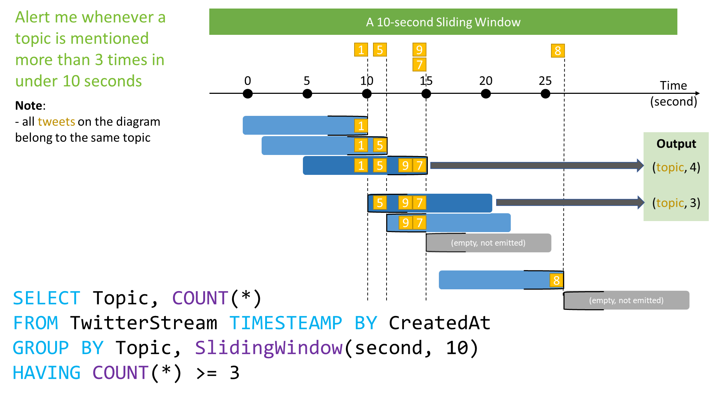

# Sliding Window (Azure Stream Analytics)
  When using a sliding window, the system is asked to logically consider all possible windows of a given length. As the number of such windows would be infinite, Azure Stream Analytics instead outputs events only for those points in time when the content of the window actually changes, in other words when an event entered or exits the window.

The following diagram illustrates a stream with a series of events and how they are mapped into sliding windows of 10 seconds.

 

## Syntax

```SQL
{SLIDINGWINDOW | SLIDING} ( timeunit, windowsize )
{SLIDINGWINDOW | SLIDING} ( Duration( timeunit, windowsize ) )

```

> [!NOTE]
>  The Sliding Window can be used in the above two ways. To allow consistency with the Hopping Window, the Duration function can also be used with all types of windows to specify the window size.

## Arguments
 **timeunit**

 Is the unit of time for the windowsize. The following table lists all valid timeunit arguments.

|Timeunit|Abbreviations|
|--------------|-------------------|
|day|dd, d|
|hour|hh|
|minute|mi, n|
|second|ss, s|
|millisecond|ms|
|microsecond|mcs|

 **windowsize**

 A big integer which describes the size of the window. The windowsize is static and cannot be changed dynamically at runtime.

 The maximum size of the window in all cases is 7 days.

## Examples
 This example finds all toll booths which have served more than 3 vehicles in the last 5 minutes:

```SQL
SELECT DateAdd(minute,-5,System.Timestamp()) AS WinStartTime, System.Timestamp() AS WinEndTime, TollId, COUNT(*)
FROM Input TIMESTAMP BY EntryTime
GROUP BY TollId, SlidingWindow(minute, 5)
HAVING COUNT(*) > 3

```


