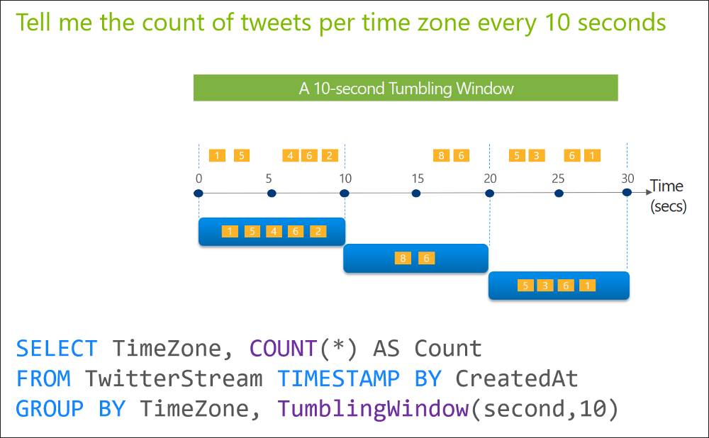

# Tumbling Window (Azure Stream Analytics)
  Tumbling windows are a series of fixed-sized, non-overlapping and contiguous time intervals. The following diagram illustrates a stream with a series of events and how they are mapped into 10-second tumbling windows.  
  
   
  
 ## Syntax  
  
```SQL   
{TUMBLINGWINDOW | TUMBLING} ( timeunit  , windowsize, [offsetsize] )  
{TUMBLINGWINDOW | TUMBLING} ( Duration( timeunit  , windowsize ), [Offset(timeunit  , offsetsize)] )  
  
```  

> [!NOTE]  
>  The Tumbling Window can be used in the above two ways. To allow consistency with the Hopping Window, the Duration function can also be used with all types of windows to specify the window size. The window duration must be a positive float constant.  
  
## Arguments  
 **timeunit**  
  
 Is the unit of time for the windowsize. The following table lists all valid timeunit arguments.  
  
|Timeunit|Abbreviations|  
|--------------|-------------------|  
|day|dd, d|  
|hour|hh|  
|minute|mi, n|  
|second|ss, s|  
|millisecond|ms|  
|microsecond|mcs|  
  
 **windowsize**  
  
 A big integer which describes the size of the window. The windowsize is static and cannot be changed dynamically at runtime.  
  
 The maximum size of the window is 7 days.  
  
 **offsetsize**  
  
 By default, tumbling windows are inclusive in the end of the window and exclusive in the beginning – for example 12:00 PM – 1:00 PM window will include events that happened exactly at 1:00 PM, but will not include events that happened at 12:00PM (these events will be part of 11:00 AM – 12:00 PM window).  
  
 The Offset parameter can be used to change this behavior and include the events in the beginning of the window and exclude the ones that happened in the end.  
  
## Examples  
  
```SQL  
SELECT System.Timestamp() AS WindowEnd, TollId, COUNT(*)  
FROM Input TIMESTAMP BY EntryTime  
GROUP BY TollId, TumblingWindow(Duration(hour, 1), Offset(millisecond, -1))
```

```SQL
SELECT 'reset' AS command
INTO
    alert
FROM
    temperature TIMESTAMP BY timeCreated
GROUP BY TumblingWindow(second,15)
HAVING Avg(machine.temperature) > 25
```

## Time considerations
 Every window operation outputs event at the end of the window. The windows of Azure Stream Analytics are opened at the window start time and closed at the window end time. For example, if you have a 5 minute window from 12:00 AM to 12:05 AM all events with timestamp greater than 12:00 AM and up to timestamp 12:05 AM inclusive will be included within this window. The output of the window will be a single event based on the aggregate function used with a timestamp equal to the window end time. The timestamp of the output event of the window can be projected in the SELECT statement using the System.Timestamp() property using an alias.
  
## See Also  
 [Hopping Window](hopping-window-azure-stream-analytics.md)   
 [Sliding Window](sliding-window-azure-stream-analytics.md)   
 [Windowing](windowing-azure-stream-analytics.md)  
  
  
