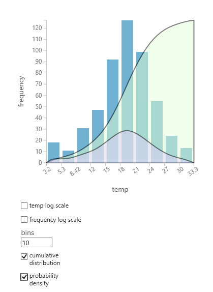

# Evaluate Probability Function
*Fits a specified probability distribution function to a dataset*  
  
 Category: [Statistical Functions](statistical-functions.md)  
  
##   Module Overview  
 You can use the [Evaluate Probability Function](evaluate-probability-function.md) module to calculate statistical measures that describe a column’s distribution, such as the Bernoulli, Pareto, or Poisson distributions.  
  
 When you evaluate your data against a probability distribution, you are mapping column values against a set of values with known properties. By knowing whether your data corresponds to one of these well-known distributions, you might be able infer other properties of your data. In general, you can get better predictions from a model when you can identify the distribution that fits the data best.  
  
 The question of which probability distribution function to use depends on the data and the variables that are being measured. For example, some distributions are designed to describe probabilities of discrete values; others are intended for use only with continuous numerical variables.  For some distributions, you must also know in advance an expected mean, degrees of freedom, and so forth. For details, see [Supported Probability Distributions](#bkmk_SupportedDist).
  
 For all probability distributions, you can compute the cumulative distribution function (**cdf**), the inverse cumulative distribution function (**InverseCdf**), or the probability density function (**Pdf**).   
 
 The **Probability Function Evaluation** module requires a dataset that contains at least one column of numerical values as input. It returns a data table that contains the values computed by the specified probability function. Optionally, you can also return the original values from the analyzed columns.  

## How to Use [Evaluate Probability Function](evaluate-probability-function.md)  

 The options for this module change depending on the type of probability distribution you want to compute, and all other options will be reset if you change the probability  distribution method. Therefore, be sure to choose the **Distribution** option first.
 
 The module requires that you connect a dataset that contains numerical data types, and then select one or more columns to analyze, using a single probability distribution method.

If you want to analyze multiple columns with different methods, use a separate instance of the module for each probability distribution that you apply.
     
  
1. Add the [Evaluate Probability Function](evaluate-probability-function.md) module to your experiment. You can find this module in the [Statistical Functions](statistical-functions.md) group in the **experiment items** list in Azure Machine Learning Studio.  

2. Connect a dataset containing at least one column of numbers. 

3.  Use the **Distribution** option to select the kind of probability distribution that you want to calculate.  See [Supported Probability Distributions](#bkmk_SupportedDist) for a list of options and their required arguments.
  
4.  Set parameters as required by the distribution.  
  
5.  Choose one of three statistics to create:  

    -   Cumulative distribution function (**cdf**)
    
        Returns the probability for a compound event, defined as the sum of ocurrences when the random variable takes a value smaller than some specific value x. In other words, it answers the question: "How common are samples that are less than or equal to this value?"  This function can be used with both continuous and discrete numeric variables. 
  
    -   Inverse cumulative distribution function (**InverseCdf**)
    
        Returns the value associated with a specific cumulative probability (cdf). In other words, it answers the question: "What is the value of x at which the cdf function returns the cumulative probability y?" 
  
    -   Probability density function (**pdf**)
    
        Describes the relative likelihood for a random variable to be a specific value. In other words, it answers the question: "How common are samples at exactly this value?"
  
 6. Use the Column Selector to choose the columns over which to compute the selected probability distribution.
 
    + All the columns you select must have a numerical data type. 
    + The range of data in the column must also be valid, given the selected probability function. Otherwise, an error or NaN result may occur. 
    + For sparse columns, any values that correspond to background zeros will not be processed.  
 
7. Use the **Result mode** option to specify how to output the results. You can replace column values with the probability distribution values, append the new values to the dataset, or return only the probability distribution values.  
  
8. Run the experiment, or right-click the [Evaluate Probability Function](evaluate-probability-function.md) module and click **Run selected**.   

### Results

For example, the following table represents partial results, using the **Append** option, on a single temperature column (from the Forest Fires sample dataset). Note that the headings of the generated columns contain the probability distribution that was used.

|temp|StandardNormal.Cdf(temp)|StandardNormal.Pdf(temp)|FFisher.cdf(temp|FFisher.cdf(temp|
|------|------|------|------|------|
|8.2|1|1|0.984774|0.004349|
|18|1|1|0.997896|0.000311|
|14.6|1|1|0.996352|0.000648|
|8.3|1|1|0.985201|0.004187|
11.4|1|1|0.993147|0.001502|

You can also chart a simple cumulative distribution and probability density of any numeric column, without using the [Evaluate Probability Function](evaluate-probability-function.md) module. This chart might be helpful in determining which probability distribution is likely to suit your data. 
1. Right-click the dataset or module output, and select **Visualize**. 
2. Select the column of interest, and in the **Histogram** pane, select **cumulative distribution** or **probability density**. 
3. A chart of the distribution, like the following, is superimposed on the histogram representing the data.

   
## Supported Probability Distributions  
 By using the [Evaluate Probability Function](evaluate-probability-function.md) module, you can calculate the following distribution types:  
  
###   Bernoulli  
 The Bernoulli distribution is a distribution over bits: in other words, a distribution over discrete values with only two possible values. The parameter p specifies the probability that a 1 is generated.  
  
 To calculate the **Bernoulli** distribution, you must set the following options:  
  
- **Probability of success**  
     Type a number (`float`) between 0.0 and 1.0 that specifies the probability of success. The default is .5.  
  
###   Beta  
 The Beta distribution is a continuous univariate distribution.  
  
 To calculate the **Beta** distribution, you must set the following options:  
  
- **Shape**  
     Type a value to change the shape of the distribution.  
  
     A shape parameter is any parameter of a probability distribution that does not define its location or scale. Therefore, when you enter a value for shape, the parameter changes the shape of the distribution rather than moving, stretching, or shrinking it.  
  
     The value must be a number (`double`). The default is 1.0.  
  
- **Scale**  
     Type a number to use for scaling the distribution.  
  
     By applying a scale value to the distribution, you can shrink or stretch it.  
  
     The default value is 1.0. Values must be positive numbers.  
  
- **Upper bound**  
     Type a number (`double`) that represents the upper bound of the distribution. The default is 1.0.  
  
- **Lower bound**  
     Type a number (`double`) that represents the lower bound of the distribution. The default is 0.0.  
  
###   Binomial  
 This is a discrete univariate distribution.  
  
 The binomial distribution is used to model the number of successes in a sample. Replacement is used when sampling. For sampling without replacement, use the [Hypergeometric distribution](#bkmk_Hypergeometric).  
  
 To calculate the **Binomial** distribution, you must set the following options:  
  
- **Probability of success**  
     Type a number (`float`) between 0.0 and 1.0 that indicates the probability of success. The default is .5.  
  
- **Number of trials**  
     Specify the number of trials.  
  
     Use an `integer`, with a minimum value of 1. The default is 3.  
  
###   Cauchy  
 The Cauchy distribution is a symmetric continuous probability distribution.  
  
 To calculate the **Cauchy** distribution, you must set the following options:  
  
 - **Location**  
     Type a number (`double`) that represents the location of the 0th element.  
  
     By specifying a value for the **Location** parameter, you can shift the probability distribution up or down a numeric scale.  
  
     The default is 0.0.  
  
###   ChiSquare  
 This distribution is a sum of the squares of k independent, standard, normal, random variables.  
  
 To calculate the **ChiSquare** distribution, you must set the following options:  
  
 - **Number of degrees of freedom** *  
     Type a number (`double`) to specify the degrees of freedom. The default is 1.0.  
  
###   ChiSquareRightTailed  
 To calculate the **ChiSquareRightTailed** distribution, you must set the following options:  
  
 - **Number of degrees of freedom** *  
     Type a number (`double`) to specify the degrees of freedom. The default is 1.0.  
  
###   Exponential  

 The exponential distribution is a distribution over the real numbers parameterized by one non-negative parameter.  
  
 To calculate the **Exponential** distribution, you must set the following options:  
  
 - **Lambda**  
     Type a number (`double`) to use as the lambda parameter. The default is 1.0.  
  
###   FFisher  

 The **FFisher** option generates the probability of the Fisher statistic for a sample, also known as the Fisher F-distribution. This distribution is two-tailed.  
  
 To calculate this distribution, you must set the following options:  
  
- **Numerator degrees of freedom**  
 Type a number (`double`) to specify the degrees of freedom that is used in the numerator. The default is 3.0.  
  
- **Denominator degrees of freedom**  
 Type a number (`double`) to specify the degrees of freedom that is used in the denominator. The default is 6.0.  
  
###   FFisherRightTailed  
 
 With the **FfisherRightTailed** option, you can create a right-tailed Fisher distribution. The Fisher distribution is also known as the Fisher F-distribution, Snedecor distribution, or Fisher-Snedecor distribution. This particular form of the distribution is right-tailed.  
  
 To calculate the **FFisherRightTailed** distribution, you must set the following options:  
  
- **Numerator degrees of freedom**  
     Type a number (`double`) to specify the degrees of freedom that is used in the numerator. The default is 3.0.  
  
- **Denominator degrees of freedom**  
     Type a number (`double`) to specify the degrees of freedom that is used in the denominator. The default is 6.0.  
  
###   Gamma  
 The gamma distribution is a family of continuous probability distributions with two parameters. For example, chi-squared is a special case of the gamma distribution.  
  
 To calculate the **Gamma** distribution, you must set the following options:  
  
- **Scale**  
     Type a value to use for scaling the distribution.  
  
     By applying a scale value to the distribution, you can shrink or stretch it.  
  
     The default value is 1.0. Values must be positive numbers.  
  
- **Location**  
     Type a number (`double`) that represents the location of the  0th element.  
  
     By specifying a value for the **Location** parameter, you can shift the probability distribution up or down a numeric scale.  
  
     The default is 0.0.  
  
###   GeneralizedExtremeValues  

 The **GeneralizedExtremeValues** option lets you create a distribution developed to handle extreme values. The generalized extreme value (GEV) distribution is actually a group of continuous probability distributions that combines the Gumbel, Fréchet, and Weibull distributions (also known as type I, II, and III extreme value distributions).  
  
 For more information about extreme value theory, see this article in Wikipedia: [Fisher-Tippet-Gnedenko theorem](http://en.wikipedia.org/wiki/Fisher%E2%80%93Tippett%E2%80%93Gnedenko_theorem).  
  
 To calculate the **GeneralizedExtremeValues** distribution, you must set the following options:  
  
- **Shape**  
    Type a value to change the shape of the distribution.  
  
    A shape parameter is any parameter of a probability distribution that does not define its location or scale. Therefore, when you enter a value for shape, the parameter changes the shape of the distribution rather than moving, stretching, or shrinking it.  
  
    The value must be a number (`double`). The default is 1.0.  
  
- **Scale**  
    Type a value to use for scaling the distribution.  
  
    By applying a scale value to the distribution, you can shrink or stretch it.  
  
    The default value is 1.0. Values must be positive numbers.  
  
- **Location**  
    Type a number (`double`) that represents the location of the 0th element.  
  
    By typing a value for the **Location** parameter, you can shift the probability distribution up or down a numeric scale.  
  
    The default is 0.0.  
  
###   Geometric  
 The Geometric distribution is a distribution over positive integers parameterized by one positive real number. This implementation of the Geometric distribution will never generate zeros.  
  
 To calculate the **Geometric** distribution, you must set the following options:  
  
- **Probability of success**  
    Type a number (`float`) between 0.0 and 1.0 that indicates the probability of success. The default is .5.  
  
###   GumbelMax  
 The Gumbel distribution is one of several extreme value distributions. The **GumbelMax** option implements the Maximum Extreme Value Type 1 distribution.  
  
 To calculate the **GumbelMax** distribution, you must set the following options:  
  
- **Scale**  
    Type a value to use for scaling the distribution.  
  
    By applying a scale value to the distribution, you can shrink or stretch it.  
  
    The default value is 1.0. Values must be positive numbers.  
  
- **Location**  
    Type a number (`double`) that represents the location of the 0th element.  
  
    By typing a value for the **Location** parameter, you can shift the probability distribution up or down a numeric scale.  
  
    The default is 0.0.  
  
###   GumbelMin  
 The Gumbel distribution is one of several extreme value distributions. The Gumbel distribution is also referred to as the Smallest Extreme Value (SEV) distribution or the Smallest Extreme Value (Type I) distribution. The **GumbelMin** option implements the Minimum Extreme Value Type 1 distribution.  
  
 To calculate the **GumbelMin** distribution, you must set the following options:  
  
- **Scale**  
    Type a value to use for scaling the distribution.  
  
    By applying a scale value to the distribution, you can shrink or stretch it.  
  
    The default value is 1.0. Values must be positive numbers.  
  
- **Location**  
    Type a number (`double`) that represents the location of the 0th element.  
  
    By typing a value for the **Location** parameter, you can shift the probability distribution up or down a numeric scale.  
  
    The default is 0.0.  
  
###   Hypergeometric  
 This distribution is a discrete probability distribution that describes the number of successes in a sequence of n draws from a finite population without replacement, just as the binomial distribution describes the number of successes for draws with replacement.  
  
 To calculate the **Hypergeometric** distribution, you must set the following options:  
  
- **Number of samples**  
    Type an integer that indicates the number of samples to use. The default is 9.  
  
- **Number of success**  
    Type an integer that defines the value for success. The default is 24.  
  
- **Population size**  
    Specify the population size to use when estimating the hypergeometric distribution.  
  
###   Laplace  
 The Laplace distribution is a distribution over the real numbers parameterized by a mean and scale parameter.  
  
 To calculate the **Laplace** distribution, you must set the following options:  
- **Scale**  
    Type a value to use for scaling the distribution.  
  
    By applying a scale value to the distribution, you can shrink or stretch it.  
  
    The default value is 1.0. Values must be positive numbers.  
  
- **Location**  
    Type a number (`double`) that represents the location of the 0th element.  
  
    By typing a value for the **Location** parameter, you can shift the probability distribution up or down a numeric scale.  
  
    The default is 0.0.  
 
###   Logistic  
 The logistic distribution is similar to the normal distribution, but it has no limit on the left side of the distribution. The logistic distribution is used in logistic regression and neural network models and for modeling life sciences data.  
  
 To calculate the **Logistic** distribution, you must set the following options:  
  
- **Scale**  
    Type a value to use for scaling the distribution.  
  
    By applying a scale value to the distribution, you can shrink or stretch it.  
  
    The default value is 1.0. Values must be positive numbers.  
  
- **Mean**  
    Type a number (`double`)that indicates the estimated mean value of the distribution. The default is 0.0.  
  
###   Lognormal  
 The lognormal distribution is a continuous univariate distribution.  
  
 To calculate the **Lognormal** distribution, you must set the following options:  
  
- **Mean**  
    Type a number (`double`) that indicates the estimated mean value of the distribution. The default is 0.0.  
  
- **Standard deviation**  
    Type a positive number (`double`) that indicates the estimated standard deviation of the distribution. The default is 1.0.  
  
###   NegativeBinomial  
 The negative binomial distribution is a distribution over the natural numbers with two parameters (r, p). In the special case that r is an integer, you can interpret the distribution as the number of tails before the rth head when the probability of the head is p.  
  
 To calculate the **NegativeBinomial** distribution, you must set the following options:  
  
- **Probability of success**  
    Type a number (`float`) between 0.0 and 1.0 that indicates the probability of success. The default is .5.  
  
- **Number of success**  
    Type an integer that specifies the value for success. The default is 24.  
  
###   Normal  
 Also known as the Gaussian distribution.  
  
 To calculate the **Normal** distribution, you must set the following options:  
  
- **Mean**  
    Type a number (`double`) that indicates the estimated mean value of the distribution. The default is 0.0.  
  
- **Standard deviation**  
    Type a positive number (`double`) that indicates the estimated standard deviation of the distribution. The default is 1.0.  
  
###   Pareto  
 The Pareto distribution is a power-law probability distribution that coincides with social, scientific, geophysical, actuarial, and many other types of observable phenomena.  
  
 To calculate the **Pareto** distribution, you must set the following options:  
  
- **Shape**  
    Type a value (optional) to change the shape of the distribution.  
  
 A shape parameter is any parameter of a probability distribution that does not define its location or scale. Therefore, when you enter a value for shape, the parameter changes the shape of the distribution rather than moving, stretching, or shrinking it.  
  
 The value must be a number (`double`). The default is 1.0.  
  
- **Scale**  
    Type a value (optional) to change the shape of the distribution.  
  
    A shape parameter is any parameter of a probability distribution that does not define its location or scale. Therefore, when you enter a value for shape, the parameter changes the shape of the distribution rather than moving, stretching, or shrinking it.  
  
    The value must be a number (`double`). The default is 1.0.  
  
###   Poisson  
 For more information about the Poisson distribution, see [Poisson Regression](poisson-regression.md). In this implementation, Knuth's method is used to generate Poisson distributed random variables.  
  
 To calculate the **Poisson** distribution, you must set the following options:  
 
- **Mean**  
    Type a number (`double`) that indicates the estimated mean value of the distribution. The default is 0.0.  
  
###   Rayleigh  
 The Rayleigh distribution is a continuous probability distribution. As an example of how it arises, the wind speed will have a Rayleigh distribution if the components of the two-dimensional wind velocity vector are uncorrelated and normally distributed with equal variance.  
  
 To calculate the **Rayleigh** distribution, you must set the following options:  
  
- **Lower bound**  
    Type a number (`double`) that represents the lower bound of the distribution. The default is 0.0.  
  
###   StandardNormal  
 To calculate the **StandardNormal** distribution, all you need to do is select the columns.  
  
###   TStudent  
 The **TStudent** option implements the univariate Student’s t-distribution.  
  
 To calculate the **TStudent** distribution, you must set the following options:  
  
- **Number of degrees of freedom**  
    Type a number (`double`) to specify the degrees of freedom. The default is 1.0.  
  
###   TStudentRightTailed  
 Implements the univariate Student’s t-distribution by using one right tail.  
  
 To calculate the **TStudentRightTailed** distribution, you must set the following options:  
  
- **Number of degrees of freedom**  
    Type a number (`double`) to specify the degrees of freedom. The default is 1.0.  
  
###   TStudentTwoTailed  
 Implements a two-tailed Student’s t-distribution.  
  
 To calculate the **TStudentTwoTailed** distribution, you must set the following options:  
  
- **Number of degrees of freedom**  
    Type a number (`double`) to specify the degrees of freedom. The default is 1.0.  
  
###   Uniform  
 The uniform distribution is also known as the rectangular distribution.  
  
 To calculate the **Uniform** distribution, you must set the following options:  
  
- **Lower bound**  
    Type a number (`double`) that represents the lower limit of the distribution. The default is 0.0.  
  
- **Upper bound**  
    Type a number (`double`) that represents the upper limit of the distribution. The default is 1.0.  
  
###   Weibull  
 The Weibull distribution is widely used in reliability engineering. It can use the **Shape** parameter to model many other distributions.  
  
 To calculate the **Weibull** distribution, you must set the following options:  
  
- **Shape**  
    Type a value (optional) to change the shape of the distribution.  
  
    A shape parameter is any parameter of a probability distribution that does not define its location or scale. Therefore, when you enter a value for shape, the parameter changes the shape of the distribution rather than moving, stretching, or shrinking it.  
  
     The value must be a number (`double`). The default is 1.0.  
  
- **Scale**  
    Type a value (optional) to change the shape of the distribution.  
  
    A shape parameter is any parameter of a probability distribution that does not define its location or scale. Therefore, when you enter a value for shape, the parameter changes the shape of the distribution rather than moving, stretching, or shrinking it.  
  
     The value must be a number (`double`). The default is 1.0.  
  
##   Technical Notes  
 This module supports all distributions that are provided in the open source MATH.NET Numerics library. For more information, see the documentation for the [Math.Net.Numerics.Distribution](http://numerics.mathdotnet.com/api/MathNet.Numerics.Distributions/index.htm) library.  
  
 Right-tailed and two-tailed distributions appear as separate distributions, not as parameterized versions of base distributions. The current behavior is to preserve compatibility with Excel.  
  
##   Expected Input  
  
|Name|Type|Description|  
|----------|----------|-----------------|  
|Dataset|[Data Table](data-table.md)|Input dataset|  
  
##   Module Parameters  
  
|Name|Range|Type|Default|Description|  
|----------|-----------|----------|-------------|-----------------|  
|Distribution|Any|ProbabilityDistribution|StandardNormal|Select the kind of probability distribution to generate.|  
|Method|Any|ProbabilityDistributionMethod|Cdf|Select the method to use when calculating the selected probability distribution.   Options are the cumulative distribution function (**cdf**), the inverse cumulative distribution function (**InverseCdf**), and the probability density function or mass function (**pdf**).|  
|Negative binomial distribution method|Any|ProbabilityDistributionMethodForNegativeBinomial|Cdf|If you select the negative binomial distribution, specify the method used for evaluating the distribution.|  
|Probability of success|[0.0;1.0]|Float|0.5|Type a value to use as the probability of success.|  
|Shape|Any|Float|1.0|Type a value that modifies the shape of the distribution.|  
|Scale|>=0.0|Float|1.0|Type a value that changes the scale of the distribution to expand or shrink it in size.|  
|Number of trials|>=1|Integer|3|Specify the number of trials.|  
|Lower bound|Any|Float|0.0|Type a number to use as the lower limit of the distribution|  
|Upper bound|Any|Float|1.0|Type a number to use as the upper limit of the distribution|  
|Location|Any|Float|0.0|Type the location of the zero element in the distribution.|  
|Number of degrees of freedom|Any|Float|1.0|Specify the number of degrees of freedom.|  
|Numerator degrees of freedom|Any|Float|3.0|Specify the number of degrees of freedom in the numerator.|  
|Denominator degrees of freedom|Any|Float|6.0|Specify the number of degrees of freedom in the denominator.|  
|Lambda|>=0.0|Float|1.0|Specify a value for the Lambda parameter.|  
|Number of samples|Any|Integer|9|Specify the number of samples.|  
|Number of success|Any|Integer|24|Type a value to use as the number of success.|  
|Population size|Any|Integer|52|Specify the population size.|  
|Mean|Any|Float|0.0|Type the estimated mean value.|  
|Standard deviation|>=0.0|Float|1.0|Type the estimated standard deviation.|  
|Column set|Any|ColumnSelection||Choose the columns over which to calculate the probability distribution.|  
|Result mode|Any|OutputTo|ResultOnly|Specify how the results are to be saved in the output dataset. The options are to append new columns, replace existing columns, or output only the results.|  
  
##   Output  
  
|Name|Type|Description|  
|----------|----------|-----------------|  
|Results dataset|[Data Table](data-table.md)|Output dataset|  
  
##   Exception  
 For a complete list of error messages, see [Module Error Codes](machine-learning-module-error-codes.md).  
  
|Exception|Description|  
|---------------|-----------------|  
|[Error 0017](errors/error-0017.md)|Exception occurs if one or more specified columns have a type that is unsupported by the current module.|  
  
## See Also  
 [Statistical Functions](statistical-functions.md)   
 [A-Z Module List](a-z-module-list.md)