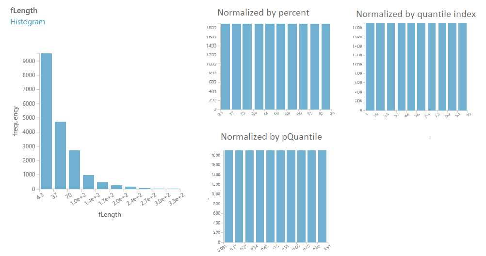

# Group Data into Bins

*Puts numerical data into bins*

Category: [Scale and Reduce](data-transformation-scale-and-reduce.md)

[!INCLUDE [studio-ui-applies-label](../includes/studio-ui-applies-label.md)]

## Module overview

This article describes how to use the [Group Data into Bins](group-data-into-bins.md) module in Machine Learning Studio (classic), to group numbers or change the distribution of continuous data.

The [Group Data into Bins](group-data-into-bins.md) module supports multiple options for binning data. You can customize how the bin edges are set and how values are apportioned into the bins. For example, you can:  

+ Manually type a series of values to serve as the bin boundaries.  
+ Calculate entropy scores to determine an information values for each range, to optimize the bins in the predictive model. + Assign values to bins by using *quantiles*, or percentile ranks.  
+ Control the number of values in each bin can also be controlled.
+ Force an even distribution of values into the bins.  

### More about binning and grouping

*Binning* or  grouping data (sometimes called *quantization*) is an important tool in preparing numerical data for machine learning, and is useful in scenarios like these:

+ A column of continuous numbers has too many unique values to model effectively, so you automatically or manually assign the values to groups, to create a smaller set of discrete ranges.

    For example, you could use entropy scores generated by [Group Data into Bins](group-data-into-bins.md) to identify the optimal groupings of data values, and use those groups as features in your model.

+ Replace a column of numbers with categorical values that represent specific ranges.

    For example, you might want to group values in an age column by specifying custom ranges, such as 1-15, 16-22, 23-30, and so forth for user demographics.

+ A dataset has a few extreme values, all well outside the expected range, and these values have an outsized influence on the trained model. To mitigate the bias in the model, you might transform the data to a uniform distribution, using the quantiles (or equal-height) method.

    With this method, the [Group Data into Bins](group-data-into-bins.md) module determines the ideal bin locations and bin widths to ensure that approximately the same number of samples fall into each bin. Then, depending on the normalization method you choose, the values in the bins are either transformed either to percentiles or mapped to a bin number.

### Examples of binning

The following diagram shows the distribution of numeric values before and after binning with the **quantiles** method. Notice that compared to the raw data at left, the data has been binned and transformed to a unit-normal scale.  

   

Another approach to binning  is demonstrated in the [Breast cancer detection](https://go.microsoft.com/fwlink/?LinkId=525726) sample, in which [Group Data into Bins](group-data-into-bins.md) is used to assign patients to various control and test groups, to guarantee that each group has an equal number of patients.  

Because there are so many ways to group data, all customizable, we recommend that you experiment with different methods and values. The [Examples](#bkmk_Examples) section contains links to sample experiments that demonstrate how to use the different binning algorithms.

## How to configure Group Data into Bins

1. Add the **Group Data Into Bins** module to your experiment in Studio (classic). You can find this module in the category **Data Transformation**, under **Scale and Reduce**.

2. Connect the dataset that has numerical data to bin.  Quantization can be applied only to columns containing numeric data. 

    If the dataset contains non-numeric columns, use the [Select Columns in Dataset](select-columns-in-dataset.md) module to select a subset of columns to work with.

3. Specify the binning mode. The binning mode determines other parameters so be sure to select the **Binning mode** option first! The following types of binning are supported:

    **Entropy MDL**: This method requires that you select the column you want to predict and the column or columns that you want to group into bins. It then makes a pass over the data and attempts to determine the number of bins that minimizes the entropy. In other words, it chooses a number of bins that allows the data column to best predict the target column.  It then returns the bin number associated with each row of your data in a column named `<colname>quantized`.

    If the **Entropy MDL** method cannot find a way to initially bin the data to make a good prediction, it assigns all data to a uniform bin. This does not mean that the column is not a good predictor. In this case, you can use other methods to find the number of bins that would minimize entropy, and make the data a better predictor.

    This method does not return the actual entropy scores.

    **Quantiles**: The quantile method assigns values to bins based on percentile ranks. Quantiles is also known as equal height binning.

    **Equal Width**: With this option, you must specify the total number of bins. The values from the data column are placed in the bins such that each bin has the same interval between starting and end values. As a result, some bins might have more values if data is clumped around a certain point.

    **Custom Edges**: You can specify the values that begin each bin. The edge value is always the lower boundary of the bin.  For example, assume you want to group values into two bins, one with values greater than 0, and one with values less than or equal to 0. In this case, for bin edges, you would type  0 in **Comma-separated list of bin edges**. The output of the module would be 1 and 2, indicating the bin index for each row value.

    **Equal Width with Custom Start and Stop**: This method is like the **Equal Width** option, but you can specify both lower and upper bin boundaries.

4. **Number of bins**: If you are using the **Entropy MDL**, **Quantiles**, and **Equal Width** binning modes, use this option to specify how many bins, or *quantiles*, that you want to create.

5. For **Columns to bin**, use the Column Selector to choose the columns that have the values you want to bin. Columns must be a numeric data type.

    The same binning rule is applied to all applicable columns that you choose. Therefore, if you need to bin some columns by using a different method, use a separate instance of [Group Data into Bins](group-data-into-bins.md) for each set of columns.

    > [!WARNING]
    > If you choose a column that is not an allowed type, a run-time error is generated. The module returns an error as soon as it finds any column of a disallowed type. If you get an error, review all selected columns. The error does not list all invalid columns.

6. For **Output mode**, indicate how you want to output the quantized values.

      + **Append**: Creates a new column with the binned values and appends that to the input table.

      + **Inplace**: Replaces the original values with the new values in the dataset.

      + **ResultOnly**: Returns just the result columns.

7. If you select the **Quantiles** binning mode, use the **Quantile normalization** option to determine how values are normalized prior to sorting into quantiles. Note that normalizing values transforms the values, but does not affect the final number of bins. For an example, see  [Effects of Different Normalization Methods](#bkmk_Effects).

    The following normalization types are supported:

    + **Percent**: Values are normalized within the range [0,100]

    + **PQuantile**: Values are normalized within the range [0,1]

    + **QuantileIndex**:  Values are normalized within the range [1,number of bins]

8. If you choose the **Custom Edges** option, type a comma-separated list of numbers to use as *bin edges* in the + **Comma-separated list of bin edges** text box.  The values mark the point that divides bins, Therefore, if you type one bin edge value, two bins will be generated; if you type two bin edge values, three bins will be generated, and so forth.

    The values must be sorted in order that the bins are created, from lowest to highest.

9. If you use the option, **Equal Width With Custom Start And Stop**, you must specify the boundaries of the bins.

    Define the lower boundary of the first bin by typing a value in the **First edge position** text box.

    Define the lower boundary of the last bin by typing a value in the **Last edge position** text box.

10. **Tag columns as categorical**: Select this option to automatically add a metadata flag to the column of binned values. The metadata flag indicates that the quantized columns should be handled as categorical variables.

11. Run the experiment, or select this module and click **Run selected**.

### Results

The [Group Data into Bins](group-data-into-bins.md) module returns a dataset in which each element has been binned according to the specified mode. 

It also returns a **Binning transformation**, which is a function that can be passed to the [Apply Transformation](apply-transformation.md) module to bin new samples of data using the same binning mode and parameters.  

To see how well the binning method functions as a predictor, you can click the dataset output from **Group Data to Bins**, and compare the label column to the binned column. If the grouping to bins is predictive, the values in the cross-tab matrix should concentrate in a few cells.

> [!TIP]
> Remember, if you use binning on your training data, you must use the same binning method on data that you use for testing and prediction. This includes the binning method, bin locations, and bin widths. 
> 
> To ensure that data is always transformed by using the same binning method, we recommend that you save useful data transformations, and then apply them to other datasets, by using the [Apply Transformation](apply-transformation.md) module.

##  Examples

For examples of how quantization is applied in machine learning scenarios, see the [Azure AI Gallery](https://gallery.azure.ai/):

+ [Breast cancer detection](https://go.microsoft.com/fwlink/?LinkId=525726): In this sample, binning is used to divide patients into equal groups by using the patient ID field.
+ [Flight delay prediction](https://go.microsoft.com/fwlink/?LinkId=525725): Uses quantile normalization to sort cases into 10 bins.
+ [Twitter sentiment analysis](https://go.microsoft.com/fwlink/?LinkId=525274): Scores are grouped into five bins representing the ranking scores.

## Technical notes

This section contains implementation details, tips, and answers to frequently asked questions.

###  Effects of different normalization methods

If you select the option, **Quantile normalization**, values are transformed before binning. Thus, the method you choose for normalization has a strong effect on the numerical values.

For example, the following table illustrates how the values in a single column, `fLength`, from the **Telescope** dataset is transformed with each of the normalization methods. The column, `fLength`, was chosen randomly for illustration of the output values from each option, and does not have a normal distribution.

|Source (fLength)|**pQuantile**|**QuantileIndex**|**Percent**|  
|-|-|-|-|  
|28.7967|0.363636|4|36.363636|  
|31.6036|0.454545|5|45.454545|  
|162.052|0.909091|10|90.909091|  
|23.8172|0.272727|3|27.272727|  

The binning results are similar for each method.

The following graphic shows the distribution of values in the column before and after binning, using the default of 10 bins.

### Implementation details

+ During quantization, each number is mapped to a bin, by comparing its value against the values of the bin edges.  

    For example, if the value is 1.5 and the bin edges are 1, 2, and 3, the element would be mapped to bin number 2. Value 0.5 would be mapped to bin number 1 (the underflow bin), and value 3.5 would be mapped to bin number 4 (the overflow bin).

+ If the column to bin (quantize) is sparse, then the bin index offset (the quantile offset) is used when the resulting column is populated. The offset is chosen so that sparse 0 always goes to the bin with an index of 0 (in other words, the quantile with value 0).

+ Sparse zeros are propagated from the input to the output column.

+ Processing of dense columns always produces results with a minimum bin index equal to 1; that is, the minimum quantile value equals the minimum value in the column. At the same time, processing of a sparse column produces a result with variable minimum bin index (minimum quantile value).

+ All NaNs and missing values are propagated from the input column to the output column. The only exception is the case when the module returns quantile indexes. In this case all NaNs are promoted to missing values.

+ Bin indices are 1-based. This is the natural convention for quantiles (1st quantile, 2nd quantile, and so on). The only exception is the case when the column to bin is sparse.

## Expected inputs

|Name|Type|Description|  
|----------|----------|-----------------|  
|Dataset|[Data Table](data-table.md)|Dataset to be analyzed|  

## Module parameters

|Name|Range|Type|Default|Description|  
|----------|-----------|----------|-------------|-----------------|  
|Binning mode|List|QuantizationMode|Quantiles|Choose a binning method|  
|Columns to bin|any|ColumnSelection|NumericAll|Choose columns for quantization|  
|Output mode|any|OutputTo||Indicate how quantized columns should be output|  
|Tag columns as categorical|any|Boolean|true|Indicate whether output columns should be tagged as categorical|  
|Number of bins|>=1|Integer|10|Specify the desired number of bins|  
|Quantile normalization|any|BinningNormalization||Choose the method for normalizing quantiles|  
|First edge position|any|Float|0.0|Specify the value for the first bin edge|  
|Bin width|any|Float|0.5|Specify a custom bin width|  
|Last edge position|any|Float|1.0|Specify the value for the last bin edge|  
|Comma-separated list of bin edges|any|String||Type a comma-separated list of numbers to use as bin edges|  

## Outputs

|Name|Type|Description|  
|----------|----------|-----------------|  
|Quantized dataset|[Data Table](data-table.md)|Dataset with quantized columns|  
|Binning transformation|[ITransform interface](itransform-interface.md)|Transformation that applies quantization to the dataset|  

## Exceptions

|Exception|Description|  
|---------------|-----------------|  
|[Error 0003](errors/error-0003.md)|Exception occurs if one or more of inputs are null or empty.|  
|[Error 0004](errors/error-0004.md)|Exception occurs if parameter is less than or equal to specific value.|  
|[Error 0011](errors/error-0011.md)|Exception occurs if passed column set argument does not apply to any of dataset columns.|  
|[Error 0021](errors/error-0021.md)|Exception occurs if number of rows in some of the datasets passed to the module is too small.|  
|[Error 0024](errors/error-0024.md)|Exception occurs if dataset does not contain a label column.|  
|[Error 0020](errors/error-0020.md)|Exception occurs if number of columns in some of the datasets passed to the module is too small.|  
|[Error 0038](errors/error-0038.md)|Exception occurs if number of elements expected should be an exact value, but is not.|  
|[Error 0005](errors/error-0005.md)|Exception occurs if parameter is less than a specific value.|  
|[Error 0002](errors/error-0002.md)|Exception occurs if one or more parameters could not be parsed or converted from specified type into required by target method type.|  
|[Error 0019](errors/error-0019.md)|Exception occurs if column is expected to contain sorted values, but it does not.|  
|[Error 0039](errors/error-0039.md)|Exception occurs if operation has failed.|  
|[Error 0075](errors/error-0075.md)|Exception occurs when an invalid binning function is used when quantizing a dataset.|  

For a list of errors specific to Studio (classic) modules, see [Machine Learning Error codes](errors/machine-learning-module-error-codes.md).

For a list of API exceptions, see [Machine Learning REST API Error Codes](/azure/machine-learning/studio/web-service-error-codes).

## See also

 [Scale and Reduce](data-transformation-scale-and-reduce.md)   
 [Normalize Data](normalize-data.md)   
 [Clip Values](clip-values.md)
