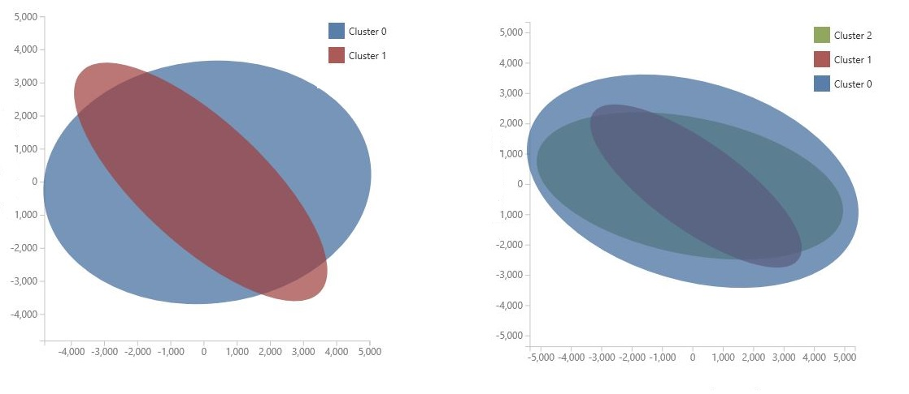
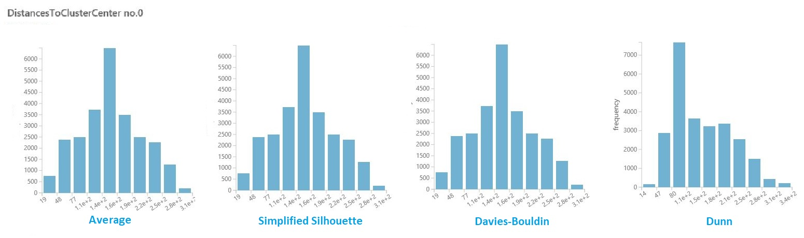

# K-Means Clustering

[!INCLUDE [ML Studio (classic) retirement](../includes/machine-learning-studio-classic-deprecation.md)]

*Configures and initializes a K-means clustering model*  
  
 Category: [Machine Learning / Initialize Model / Clustering](machine-learning-initialize-model-clustering.md)  

[!INCLUDE [studio-ui-applies-label](../includes/studio-ui-applies-label.md)]
  
## Module overview  
 
 This article describes how to use the **K-Means Clustering** module in Machine Learning Studio (classic) to create an untrained K-means clustering model. 
 
 K-means is one of the simplest and the best known *unsupervised* learning algorithms, and can be  used for a variety of machine learning tasks, such as [detecting abnormal data](https://msdn.microsoft.com/magazine/jj891054.aspx), clustering of text documents, and analysis of a dataset prior to using other classification or regression methods. To create a clustering model, you add this module to your experiment, connect a dataset, and set parameters such as the number of clusters you expect, the distance metric to use in creating the clusters, and so forth. 
  
 After you have configured the module hyperparameters, connect the untrained model to the [Train Clustering Model](train-clustering-model.md) or the [Sweep Clustering](sweep-clustering.md) modules to train the model on the input data that you provide.  Because the K-means algorithm is an unsupervised learning method, a label column is optional. 

 + If your data includes a label, you can use the label values to guide selection of the clusters and optimize the model. 
 + If your data has no label, the algorithm creates clusters representing possible categories, based solely on the data.  
  
> [!TIP]
> If your training data has labels, consider using one of the supervised [classification](machine-learning-initialize-model-classification.md) methods provided in Machine Learning. For example, you might compare the results of clustering to the results when using one of the multiclass decision tree algorithms. 
  
##  Understanding k-means clustering
 
In general, clustering uses iterative techniques to group cases in a dataset into clusters that contain similar characteristics. These groupings are useful for exploring data, identifying anomalies in the data, and eventually for making predictions. Clustering models can also help you identify relationships in a dataset that you might not logically derive by browsing or simple observation. For these reasons, clustering is often used in the early phases of machine learning tasks, to explore the data and discover unexpected correlations.  
  
 When you configure a clustering model using the k-means method, you must specify a target number *k* indicating the number of *centroids* you want in the model. The centroid is a point that is representative of each cluster. The K-means algorithm assigns each incoming data point to one of the clusters by minimizing the within-cluster sum of squares. 
 
When processing the training data, the K-means algorithm begins with an initial set of randomnly chosen centroids, which serve as starting points for each cluster, and applies Lloyd's algorithm to iteratively refine the locations of the centroids. The K-means algorithm stops building and refining clusters when it meets one or more of these conditions:  
  
-   The centroids stabilize, meaning that cluster assignments for individual points no longer change and the algorithm has converged on a solution.  
  
-   The algorithm completed running the specified number of iterations.  
  
 After completing the training phase, you use the [Assign Data to Clusters](assign-data-to-clusters.md) module to assign new cases to one of the clusters that was found by the k-means algorithm. Cluster assignment is performed by computing the distance between the new case and the centroid of each cluster. Each new case is assigned to the cluster with the nearest centroid.  

## How to configure K-Means Clustering
  
1.  Add the **K-Means Clustering** module to your experiment.  
  
2.  Specify how you want the model to be trained, by setting the **Create trainer mode** option.  
  
    -   **Single Parameter**: If you know the exact parameters you want to use in the clustering model, you can provide a specific set of values as arguments.  
  
    -   **Parameter Range**: If you are not sure of the best parameters, you can find the optimal parameters by specifying multiple values and using the [Sweep Clustering](sweep-clustering.md) module to find the optimal configuration.  
  
         The trainer iterates over multiple combinations of the settings you provided and determine the combination of values that produces the optimal clustering results.  
  
3.  For **Number of Centroids**, type the number of clusters you want the algorithm to begin with.  
  
     The model is not guaranteed to produce exactly this number of clusters. The algorithn starts with this number of data points and iterates to find the optimal configuration, as described in the [Technical Notes](#TechnicalNotes) section.  
  
     If you are performing a parameter sweep, the name of the property changes to **Range for Number of Centroids**. You can use the **Range Builder** to specify a range, or you can type a series of numbers representing different numbers of clusters to create when initializing each model.  
  
4.  The properties **Initialization** or **Initialization for sweep** are used to specify the algorithm that is used to define the initial cluster configuration.  
  
    -   **First N**: Some initial number of data points are chosen from the data set and used as the initial means.  
  
         Also called the *Forgy method*.  
  
    -   **Random**: The algorithm randomly places a data point in a cluster and then computes the initial mean to be the centroid of the cluster's randomly assigned points.  
  
         Also called the *random partition* method.  
  
    -   **K-Means++**: This is the default method for initializing clusters.  
  
         The **K-means ++** algorithm was proposed in 2007 by David Arthur and Sergei Vassilvitskii to avoid poor clustering by the standard k-means algorithm. **K-means ++** improves upon standard K-means by using a different method for choosing the initial cluster centers.  
  
    -   **K-Means++Fast**: A variant of the **K-means ++** algorithm that was optimized for faster clustering.  
  
    -   **Evenly**: Centroids are located equidistant from each other in the d-Dimensional space of n data points.  
  
    -   **Use label column**: The values in the label column are used to guide the selection of centroids.  
  
5.  For **Random number seed**, optionally type a value to use as the seed for the cluster initialization. This value can have a significant effect on cluster selection.  
  
     If you use a parameter sweep, you can specify that multiple initial seeds be created, to look for the best initial seed value. For **Number of seeds to sweep**, type the total number of random seed values to use as starting points.  
  
6.  For **Metric**, choose the function to use for measuring the distance between cluster vectors, or between new data points and the randomly chosen centroid. Machine Learning supports the following cluster distance metrics:  
  
    -   **Euclidean**: The Euclidean distance is commonly used as a measure of cluster scatter for K-means clustering. This metric is preferred because it minimizes the mean distance between points and the centroids.
  
    -   **Cosine**: The cosine function is used to measure cluster similarity. Cosine similarity is useful in cases where you do not care about the length of a vector, only its angle.  
  
7.  For **Iterations**, type the number of times the algorithm should iterate over the training data before finalizing the selection of centroids.  
  
     You can adjust this parameter to balance accuracy vs. training time.  
  
8.  For **Assign label mode**, choose an option that specifies how a label column, if present in the dataset, should be handled.  
  
     Because K-means clustering is an unsupervised machine learning method, labels are optional. However, if your dataset already has a label column, you can use those values to guide selection of the clusters, or you can specify that the values be ignored.  
  
    -   **Ignore label column**: The values in the label column are ignored and are not used in building the model.  
  
    -   **Fill missing values**: The label column values are used as features to help build the clusters. If any rows are missing a label, the value is imputed by using other features.  
  
    -   **Overwrite from closest to center**: The label column values are replaced with predicted label values, using the label of the point that is closest to the current centroid.  
  
9. Train the model.  
  
    -   If you set **Create trainer mode** to **Single Parameter**, add a tagged dataset and train the model by using the [Train Clustering Model](train-clustering-model.md) module.  
  
    -   If you set **Create trainer mode** to **Parameter Range**, add a tagged dataset and train the model using [Sweep Clustering](sweep-clustering.md). You can use the model trained using those parameters, or you can make a note of the parameter settings to use when configuring a learner.  

### Results

After you have finished configuring and training the model, you have a model that you can use to generate scores. However, there are multiple ways to train the model, and multiple ways to view and use the results: 

#### Capture a snapshot of the model in your workspace

+ If you used the [Train Clustering Model](train-clustering-model.md) module
    1. Right-click the [Train Clustering Model](train-clustering-model.md) module.
    2. Select **Trained model** and then click **Save as Trained Model**.

+ If you used the [Sweep Clustering](sweep-clustering.md) module to train the model
    1. Right-click the **Sweep Clustering** module.
    2. Select **Best Trained model** and then click **Save as Trained Model**.

The saved model will represent the training data at the time you saved the model. If you later update the training data used in the experiment, it will not update the saved model. 

#### See a visual representation of the clusters in the model

+ If you used the [Train Clustering Model](train-clustering-model.md) module
    1. Right-click the module, and select **Results dataset**. 
    2. Select **Visualize**. 

+ If you used the [Sweep Clustering](sweep-clustering.md) module
    1. Add an instance of the [Assign Data to Clusters](assign-data-to-clusters.md) module and generate scores using the **Best Trained model**. 

    2. Right-click the **Assign Data to Clusters** module, select **Results dataset**, and select **Visualize**. 

The chart is generated by using [Principal Component Analysis](principal-component-analysis.md), which is a technique in data science for compressing the feature space of a model. The chart shows some set of features, compressed into two dimensions, that best characterize the difference between the clusters. By visually reviewing the general size of the feature space for each cluster and how much the clusters overlap, you can get an idea of how well your model might perform.

   For example, the following PCA charts represent the results from two models trained using the same data: the first was configured to output two clusters, and the second was configured to output three clusters. From these charts, you can see that increasing the number of clusters did not necessarily improve separation of the classes. 

> [!TIP]
> Use the [Sweep Clustering](sweep-clustering.md) module to choose the optimal set of hyperparameters, including the random seed and number of starting centroids. 

#### See the list of data points and the clusters they belong to

There are two options for viewing the dataset with results, depending on how you trained the model:
    
- If you used the [Sweep Clustering](sweep-clustering.md) module to train the model
    
    1. Use the checkbox in the **Sweep Clustering** module to specify whether you want to see the input data together with the results, or see just the results.
    2. When training is complete, right-click the module, and select **Results dataset** (output number 2)
    3. Click **Visualize**.  
   
- If you used the **Train Clustering Model** module
    
   1. Add the [Assign Data to Clusters](assign-data-to-clusters.md) module and connect the trained model to the left-hand input. Connect a dataset to the right-hand input. 
   2. Add the [Convert to Dataset](convert-to-dataset.md) module to your experiment and connect it to the output of **Assign Data to Clusters**.  
   3. Use the checkbox in the **Assign Data to Clusters** module to specify whether you want to see the input data together with the results, or see just the results.
   3. Run the experiment, or run just the **Convert to Dataset** module.
   4. Right-click **Convert to Dataset**, select **Results dataset**, and click **Visualize**. 

The output contains the input data columns first, if you included them, and the following columns for each row of input data:

+ **Assignment**: The assignment is a value between 1 and *n*, where *n* is the total number of clusters in the model. Each row of data can be assigned to only one cluster.

+ **DistancesToClusterCenter no.n**:  This value measures the distance from the current data point to the centroid for the cluster. A separate column in output for each cluster in the trained model.

    The values for cluster distance are based on the distance metric you selected in the option, **Metric for measuring cluster result**. Even if you perform a parameter sweep on the clustering model, only one metric can be applied during the sweep. If you change the metric, you might get different distance values. 

#### Visualize intra-cluster distances

In the dataset of results from the previous section, click the column of distances for each cluster. Studio (classic) displays a histogram that visualizes the distribution of distances for points within the cluster.  
    
For example, the following histograms show the distribution of cluster distances from the same experiment, using four different metrics. All other settings for the parameter sweep were the same. Changing the metric resulted in a different number of clusters in one model.

In general, you should choose a metric that maximizes the distance between data points in different classes, and minimizes distances within a class. You can use the precomputed means and other values in the **Statistics** pane to guide you in this decision.

> [!TIP]
> You can extract means and other values used in visualizations by using the [PowerShell module for Machine Learning](https://github.com/hning86/azuremlps). 
> 
> Or use the [Execute R Script](execute-r-script.md) module to compute a custom distance matrix.   

### Tips for generating the best clustering model  

It is known that the **seeding** process used during clustering can significantly affect the model. Seeding means the initial placement of points into potental centroids.
 
For example, if the dataset contains many outliers, and an outlier is chosen to seed the clusters, no other data points would fit well with that cluster and the cluster could be a singleton: that is, a cluster with only one point.  
  
There are various ways to avoid this problem:  
  
-   Use a parameter sweep to change the number of centroids and try multiple seed values.  
  
-   Create multiple models, varying the metric or iterating more.  
  
-   Use a method such as PCA to find variables that have a detrimental effect on clustering. See the [Find similar companies](https://gallery.azure.ai/Experiment/60cf8e46935c4fafbf86f669121a24f0) sample for a demonstration of this technique.  
  
In general, with clustering models, it is possible that any given configuration will result in a locally optimized set of clusters. In other words, the set of clusters returned by the model suits only the current data points, and is not generalizable to other data. If you used a different initial configuration, the K-means method might find a different, perhaps superior, configuration. 

> [!IMPORTANT]
> We recommend that you always experiment with the parameters, create multiple models, and compare the resulting models. 
  
##  Examples

For examples of how K-means clustering is used in Machine Learning, see these experiments in the [Azure AI Gallery](https://gallery.azure.ai/):  
  
- [Group iris data](https://gallery.azure.ai/Experiment/a7299de725a141388f373e9d74ef2f86): Compares the results of **K-Means Clustering** and [Multiclass Logistic Regression](multiclass-logistic-regression.md) for a classification task.
  
- [Color Quantization sample](https://go.microsoft.com/fwlink/?LinkId=525272): Builds multiple K-means models with different parameters to find the optimum image compression.  
  
-  [Clustering: Similar Companies](https://go.microsoft.com/fwlink/?LinkId=525164): Varies the numbers of centroids to find groups of similar companies in the S&P500.
  
##   Technical notes  

Given a specific number of clusters (*K*) to find for a set of *D*-dimensional data points with *N* data points, the K-means algorithm builds the clusters as follows:  
  
1.  The module initializes a *K*-by-*D* array with the final centroids that define the *K* clusters found.  
  
2.  By default, the module assigns the first *K* data points in order to the *K* clusters.  
  
3.  Starting with an initial set of *K* centroids, the method uses Lloyd's algorithm to iteratively refine the locations of the centroids.  
  
4.  The algorithm terminates when the centroids stabilize or when a specified number of iterations are completed.  
5.  A similarity metric (by default, Euclidean distance) is used to assign each data point to the cluster that has the closest centroid.  

  
> [!WARNING]
>  -   If you pass a parameter range to [Train Clustering Model](train-clustering-model.md), it uses only the first value in the parameter range list.  
> -   If you pass a single set of parameter values to the [Sweep Clustering](sweep-clustering.md) module, when it expects a range of settings for each parameter, it ignores the values and uses the default values for the learner.  
> -   If you select the **Parameter Range** option and enter a single value for any parameter, that single value you specified is used throughout the sweep, even if other parameters change across a range of values.
 
      
##  Module parameters  
  
|Name|Range|Type|Default|Description|  
|----------|-----------|----------|-------------|-----------------|  
|Number of Centroids|>=2|Integer|2|Number of Centroids|  
|Metric|List (subset)|Metric|Euclidean|Selected metric|  
|Initialization|List|Centroid initialization method|K-Means++|Initialization algorithm|  
|Iterations|>=1|Integer|100|Number of iterations|  
  
##  Outputs  
  
|Name|Type|Description|  
|----------|----------|-----------------|  
|Untrained model|[ICluster interface](icluster-interface.md)|Untrained K-Means clustering model|  
  
##  Exceptions  

For a list of all exceptions, see [Machine Learning Module Error Codes](errors/machine-learning-module-error-codes.md).  
  
|Exception|Description|  
|---------------|-----------------|  
|[Error 0003](errors/machine-learning-module-error-codes.md)|Exception occurs if one or more of inputs are null or empty.|  
  
## See also
  
 [Clustering](machine-learning-initialize-model-clustering.md)   
 [Assign Data to Clusters](assign-data-to-clusters.md)   
 [Train Clustering Model](train-clustering-model.md)   
 [Sweep Clustering](sweep-clustering.md)
