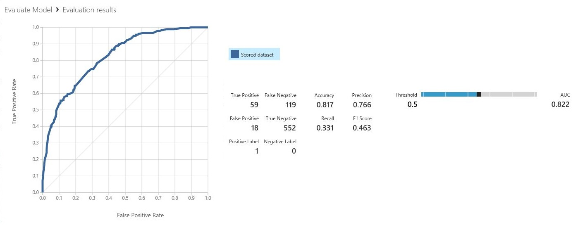
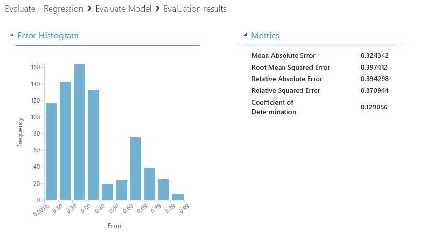

# Machine Learning - Evaluate

This article describes the modules in Machine Learning Studio (classic) that you can use to evaluate a machine learning model. _Model evaluation_ is performed after training is complete, to measure the accuracy of the predictions and assess model fit.

[!INCLUDE [studio-ui-applies-label](../includes/studio-ui-applies-label.md)]

This article also describes the overall process in Machine Learning Studio (classic) for model creation, training, evaluation, and scoring.

## Create and use machine learning models in Machine Learning Studio (classic)

The typical workflow for machine learning includes these phases:

1. Choose a suitable algorithm and set initial options.
2. Train the model by using compatible data.
3. Create predictions by using new data that's based on the patterns in the model.
4. Evaluate the model to determine whether the predictions are accurate, the amount of error, and whether overfitting occurs.

Machine Learning Studio (classic) supports a flexible, customizable framework for machine learning. Each task in this process is performed by a specific type of module. The module can be modified, added, or removed without breaking the rest of your experiment.

Use the modules in this category to evaluate an existing model. Model evaluation typically requires some kind of result dataset. If you don't have an evaluation dataset, you can generate results by scoring. You can also use a test dataset, or some other set of data that contains "ground truth" or known expected results.

### More about model evaluation

In general, when evaluating a model, your options depend on the type of model you are evaluating, and the metric that you want to use. These topics list some of the most frequently used metrics:

- [Evaluate Model](evaluate-model.md)
- [Cross-Validate Model ](cross-validate-model.md)

Machine Learning Studio (classic) also provides a variety of visualizations, depending on the type of model you're using, and how many classes your model is predicting. For help finding these visualizations, see [View evaluation metrics](#bkmk_ViewMetrics).

Interpreting these statistics often requires a greater understanding of the particular algorithm on which the model was trained. For a good explanation of how to evaluate a model, and how to interpret the values that are returned for each measure, see [How to evaluate model performance in Machine Learning](/azure/machine-learning/classic/evaluate-model-performance).

## List of modules

The **Machine Learning - Evaluate** category includes the following modules:

- [Cross-Validate Model](cross-validate-model.md): Cross-validates parameter estimates for classification or regression models by partitioning the data.

    Use the [Cross-Validate Model](cross-validate-model.md) module if you want to test the validity of your training set and the model. Cross-validation partitions the data into folds, and then tests multiple models on combinations of folds.

- [Evaluate Model](evaluate-model.md): Evaluates a scored classification or regression model by using standard metrics.

    In most cases, you'll use the generic [Evaluate Model](evaluate-model.md) module. This is especially true if your model is based on one of the supported classification or regression algorithms.

- [Evaluate Recommender](evaluate-recommender.md): Evaluates the accuracy of recommender model predictions.

    For recommendation models, use the [Evaluate Recommender](evaluate-recommender.md) module.

## Related tasks

- For clustering models, use the [Assign Data to Clusters](assign-data-to-clusters.md) module. Then, use the visualizations in that module to see evaluation results.
- You can create custom evaluation metrics. To create custom evaluation metrics, provide R code in the [Execute R Script](execute-r-script.md) module, or Python code in the [Execute Python Script](execute-python-script.md) module. This option is handy if you want to use metrics that were published as part of open-source libraries, or if you want to design your own metric for measuring model accuracy.

## Examples

Interpreting the results of machine learning model evaluation is an art. It requires understanding the mathematical results, in addition to the data and the business problems. We recommend that you review these articles for an explanation of how to interpret results in different scenarios:

- [Choose parameters to optimize your algorithms in Machine Learning](/azure/machine-learning/classic/algorithm-parameters-optimize)
- [Interpret model results in Machine Learning](/azure/machine-learning/classic/interpret-model-results)
- [Evaluate model performance in Machine Learning](/azure/machine-learning/classic/evaluate-model-performance)

## Technical notes

This section contains implementation details, tips, and answers to frequently asked questions.

### View evaluation metrics

Learn where to look in Machine Learning Studio (classic) to find the metric charts for each model type.

#### Two-class classification models

The default view for binary classification models includes an interactive ROC chart and a table of values for the principal metrics.

You have two options for viewing binary classification models:

- Right-click the module output, and then select **Visualize**.
- Right-click the module, select **Evaluation results**, and then select **Visualize**.

You can also use the slider to change the probability **Threshold** value. The threshold determines whether a result should be accepted as true or not. Then, you can see how these values change.

#### Multiclass classification models

The default metrics view for multi-class classification models includes a confusion matrix for all classes and a set of metrics for the model as a whole.

You have two options for viewing multi-class classification models:

- Right-click the module output, and then select **Visualize**.
- Right-click the module, select **Evaluation results**, and then select **Visualize**.

For simplicity, here are the two results, shown side by side:

#### Regression models

The metrics view for regression models varies depending on the type of model that you created. The metrics view is based on the underlying algorithm interfaces, and on the best fit for the model metrics.

You have two options for viewing regression models:

- To view the accuracy metrics in a table, right-click the **Evaluate Model** module's output, and then select **Visualize**.
- To view an error histogram with the values, right-click the module, select **Evaluation results**, and then select **Visualize**.

The **Error Histogram** view can help you understand how error is distributed. It's provided for the following model types, and includes a table of default metrics, such as root mean squared error (RMSE).

- [Boosted Decision Tree Regression](boosted-decision-tree-regression.md)
- [Linear Regression](linear-regression.md)
- [Neural Network Regression](neural-network-regression.md)

The following regression models generate a table of default metrics, along with some custom metrics:

- [Bayesian Linear Regression](bayesian-linear-regression.md)
- [Decision Forest Regression](decision-forest-regression.md)
- [Fast Forest Quantile Regression](fast-forest-quantile-regression.md)
- [Ordinal Regression](ordinal-regression.md)

### Tips for working with the data

To extract the numbers without copying and pasting from the Machine Learning Studio (classic) UI, you can use the new [PowerShell library for Machine Learning](https://github.com/hning86/azuremlps). You can get metadata and other information for an entire experiment, or from individual modules.

To extract values from an **Evaluate Model** module, you must add a unique comment to the module, for easier identification. Then, use the **Download-AmlExperimentNodeOutput** cmdlet to get the metrics and their values from the visualization in JSON format.

For more information, see [Create machine learning models by using PowerShell](/azure/machine-learning/classic/powershell-module).

## See also

- [Train](machine-learning-train.md)
- [Score](machine-learning-score.md)
- [Evaluate](machine-learning-evaluate.md)
- [Module categories and descriptions](machine-learning-module-descriptions.md)
- [A-Z module list](a-z-module-list.md)
