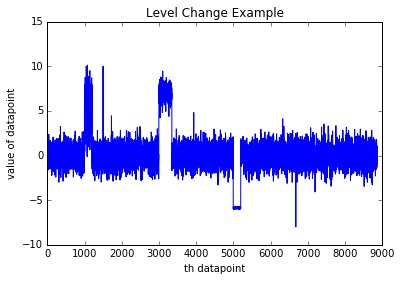
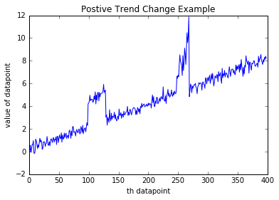
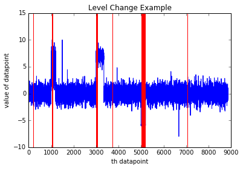
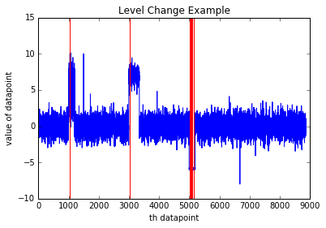
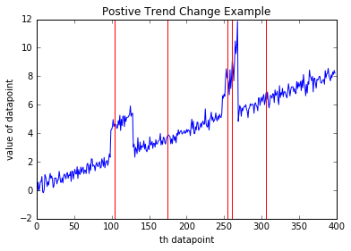
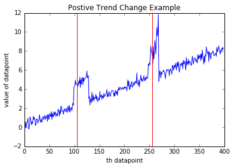

# Time Series Anomaly Detection

[!INCLUDE [ML Studio (classic) retirement](../includes/machine-learning-studio-classic-deprecation.md)]

*Detects anomalies in the input time series data.*  
  
 Category: Time Series  

[!INCLUDE [studio-ui-applies-label](../includes/studio-ui-applies-label.md)]
  
## Module overview  
 
This article describes how to use the **Time Series Anomaly Detection** module in Machine Learning Studio (classic), to detect anomalies in time series data. The module learns the normal operating characteristics of a time series that you provide as input, and uses that information to detect deviations from the normal pattern. The module can detect both changes in the overall trend, and changes in the magnitude or range of values.  

Detecting changes in time series data has wide applications. For example, you could use it for near-real-time  monitoring of sensors, networks, or resource usage. By tracking service errors, service usage, and other KPIs, you can respond quickly to critical anomalies. Other applications include health care and finance.  
### Anomaly detection methods  

Anomaly detection is the problem of finding patterns in data that do not conform to a model of "normal" behavior. Typical approaches for detecting such changes either use simple human computed thresholds, or mean and standard deviation to determine when data deviates significantly from the mean.  
  
However, such simple approaches are not easily adapted to time series data:  
  
-   Large numbers of false anomalies are generated  
  
-   The methods are not applicable to changing data values  
  
-   Cannot easily scale to large time series  
  
 This module provides two additional methods for assessing variance from a time series trend:  
  
-   Measuring the magnitude of upward and downward changes  
  
     For example, the number of requests on a web service might bestable for some time and then dramatically increase.  
  
-   Measuring the direction and duration of trends: positive vs. negative changes  
  
     For example, a persistent upward trend in the length of a service queue might indicate an underlying issue. Even though the overall trend is consistently increasing and therefore might be considered stable, a change in slope could be flagged as an anomaly. Conversely, if you are monitoring memory usage of a server, a constant decrease in free memory size might indicate an issue.  

###  Examples of anomalous patterns in time series

**Upward and downward level changes** 

For example, assume you have been monitoring the number of requests per day to a web service over a period of time, and the number of requests appears to stay within a certain range. However, after an update to the web service, the number of requests to that web service changes. The new trend might be either higher or lower than the original trend; both upward and downward spikes can be detected.  
  
  
  
**Positive or negative trends changes**

For example, assume you are monitoring the length of a queue on a service support site. A persistent upward trend might indicate an underlying service issue.  

In other cases,  a persistent negative trend might be the anomaly. For example, if you are monitoring memory usage on a server, when free memory size shrinks, it could  indicate a potential memory leak.  

  

## Resources

For more information about the research underlying this approach, see these articles:  
  
+ Shen-Shyang Ho; Wechsler, H., "A Martingale Framework for Detecting Changes in Data Streams by Testing Exchangeability," Pattern Analysis and Machine Intelligence, IEEE Transactions , vol.32, no.12, pp.2113,2127, Dec. 2010  
  
    [Sources and citations (Microsoft Academic)](https://academic.microsoft.com/#/detail/2137702884)  
  
+ Valentina Fedorova, Alex J. Gammerman, Ilia Nouretdinov, Vladimir Vovk, “Plug-in martingales for testing exchangeability on-line”, ICML 2012  
  
    [Sources and citations (Microsoft Academic)](https://academic.microsoft.com/#/detail/2165167415)  
  
+ Vladimir Vovk, Ilia Nouretdinov, Alex J. Gammerman, “Testing Exchangeability Online”, ICML 2003.  
  
    [Sources and citations (Microsoft Academic)](https://academic.microsoft.com/#/detail/135042828)  

## How to configure Time Series Anomaly Detection  
  
1.  Add the **Time Series Anomaly Detection** module to your experiment and connect the dataset that contains the time series.  
  
     The dataset used as input must contain at least one column containing datetime values in string format, and another column that contains the trend values, in a numeric format. Other columns are ignored.  
  
     Because each row corresponds to a data point in the time series representing the value at that time, the time values should be unique.  
  
2.  **Data Column**: Select a single column in your dataset that contains numeric data values. These values are the data points in the trend that you want to model, such as population totals over time, costs per month, or temperatures over some period.  
  
3.  **Time Column**: Select a single column in your dataset that contains the associated time series value.  
  
    The column must contain valid datetime values, meaning that all dates must be within the range of dates supported by the .NET Framework.  
  
    The Time column must use the DateTime data type. If your dates are in string format, you can cast them using the [Apply SQL Transformation](apply-sql-transformation.md) module, or convert them using the [Execute R Script](execute-r-script.md) module. If your dates are represented as integers, you must also use an appropriate datetime conversion function to represent the values using a valid datetime format.  
  
    For example, the following SQL statement changes an Excel serial date value to a datetime format:  
  
    ```sql
     SELECT CAST([SerialDate]  AS SmallDateTime) as [NewValidDate] from t1;  
    ```
     
    After the date values are in the correct format, use the Edit Metadata module to set the column type to DateTime.  
  
4.  **Martingale Type**: Select the martingale function to use.  
  
    - **PowerAvg**. This option is a marginalized implementation of the power martingale.  
  
        The default value is **PowerAvg** with no additional parameters. This option gives a more stable anomaly detector and should be suitable for most needs.  
  
    - **Power**.  A non-marginalized implementation of the power martingale.  
  
        The **Power** option provide users with the option to provide a value between 0 and 1 for the **Epsilon** parameter to control the sensitivity of the detector.  Generally, a higher epsilon value means higher sensitivity to anomalies but less certainty.  
  
    For a definition of martingales and the methods used in this module, see: [Anomaly detection using machine learning to detect abnormalities in time series data](https://blogs.technet.microsoft.com/machinelearning/2014/11/05/anomaly-detection-using-machine-learning-to-detect-abnormalities-in-time-series-data/)  
  
5.  **Strangeness Function Type**: This option is used to specific different types of anomalies. Three options are supported, which require no further parameters:  
  
    - **RangePercentile**.  
  
        This is the default, and is mostly used for detecting level changes.  
  
    - **SlowPosTrend**. Choose this option to detect positive trend changes.  
  
    -   **SlowNegTrend**. Choose this option to detect negative trend changes.  
  
6. **Length of Martingale** and **Strangeness Values**: Specify the size of the history window, which is used to compute martingale values over the  look-back history.  
  
    The default value is 500, but you can specify any integer between 0 and 5000. For large time series, the default value should work well. For smaller time series, you can try to estimate the value for the expected length of the abnormal behavior.  
  
    We recommend that you generally set these two parameters to the same value.  
  
7. **Length of Strangeness Values**: Specify the length of the history window used to compute strangeness at each data point.  
  
    The default value is 500, but you can specify any integer between 0 and 5000.  
  
    This parameter has the same restrictions as **Length of Martingale**. That is, you should set the value to the estimated number of data points that are needed to learn "normal" behavior.  
  
     The default of 500 works well for most cases, but if the scale over which "normalcy" is measured varies, it might be beneficial to make **Length of Strangeness Values** a greater value than **Length of Martingale**.  
  
     For example, if you are monitoring errors, and assume that data points are captured at 15-min intervals, the time needed to learn the normal trend might vary greatly from month to month.  
  
     In general, using a larger window size leads to slower performance, because the module has to learn over a larger dataset.  
  
     We recommend that you generally set these two parameters to the same value.  
  
8.  **Alert Threshold**:  Specify a value above which the anomaly score generates an alert.  
  
     The default value is 3.25, meaning that an alert is generated for every row containing a score of 3.25 or more. Y  
  
     You can specify any floating point number between 0 and 100.  However, there is a tradeoff between sensitivity and confidence in the choice of threshold:  
  
    -   A lower threshold would make the detector more sensitive to anomalies and generate more alerts.  
  
    -   A lower threshold might result in normal changes being misclassified as anomalies.  
  
9. Run the experiment.  
  
     Note that you do not need to train this model separately; the algorithm learns the pattern from the data you provide as input to this module.  
  
### Results

When training is complete, the module outputs a time series that is the same length as the input time series; however, two columns are added to indicate values that are potentially anomalous.  
  
+ **Anomaly Score**: The first column contains a score that represents the likelihood that the time series value is anomalous.  
  
+ **Alert**: This column contain a flag with a value of 0 or 1, where 1 means that an anomaly was detected. You can set the threshold for generating the alert based on the score column, but setting the **Alert Threshold** parameter.

## Examples  

The following examples demonstrate how to set the martingale function to detect anomalies and how to interpret the results. 
### Detect level changes  

To illustrate the impact of different settings, the example dataset used in this example consists of 8870 data points, with three level changes. Based on this data, we created two models, using the following parameters. 
  
+ **Martingale Type**: **PowerAvg**  
  
+ **Strangeness function type**: **RangePercentile**  
  
+ **Length of Martingale** = 50  
  
+ **Length of Strangeness Values** = 50  

The model was trained on the incoming data, but a different value was applied for **Alert Threshold**. The results of prediction are plotted in the following images for Model 1 and Model 2. In these graphs, the blue lines represent the data values, and the red lines represent the **alerts** raised for an anomaly.

**Alert threshold of 0.9**
  
   
  
In this model, the threshold value is lower, and therefore alerts are raised (anomalies detected) even when the changes are momentary.  

Depending on the type of time series you are monitoring, some of these alerts might be considered false alerts.  However, a lower threshold might be preferable if you cannot afford to overlook any anomaly.  

**Alert threshold of 3.25**  
  
   
  
In this model, the alert threshold was much higher, and as a result, the model detects only those changes that persist longer. A higher threshold for alerting might be more desirable in a scenario where you only want to catch more long-lasting changes.  

### Detect positive slope changes  

To illustrate this option for anomaly detection, we used an example dataset containing 300 data points. All the points formed a positive trend overall, with two anomalies.

Again, we created two models using parameters that were identical except for the alert threshold value.  
  
+ **Martingale Type**: **PowerAvg**  
  
+ **Strangeness function type**: **SlowPosTrend**  
  
+ **Length of Martingale** = 50  
  
+ **Length of Strangeness Values** = 50  
  
In these graphs, the blue lines represent data values and the red lines represent alerts raised for an anomaly.  
  
**Alert Threshold of 4.25**  
  
   
  
**Alert Threshold of 6.0**  
  
   
  
We recommend that you experiment with different alert threshold values to find the appropriate level of sensitivity for your anomaly detection scenario.  

## Expected inputs

|Name|Type|Description|  
|----------|----------|-----------------|  
|Input data containing time stamps and values|[Data Table](data-table.md)|Input data containing date-time stamps and values.|  

## Module parameters

|Name|Type|Range|Optional|Default|Description|  
|----------|----------|-----------|--------------|-------------|-----------------|  
|Value Column|ColumnSelection||Required||Choose the column that contains the time series to track|  
|Window Size|Integer||Required||Specify a value that controls the size of the analysis window|  
|Threshold|Float||Optional||Specify a value that determines the threshold on the score to identify an anomaly|  

## Outputs
  
|Name|Type|Description|  
|----------|----------|-----------------|  
|Time series annotated with anomaly scores|[Data Table](data-table.md)|Dataset with anomaly intervals.|  
  
## See also  
 [Anomaly Detection](anomaly-detection.md)   
 [One-Class Support Vector Machine](one-class-support-vector-machine.md)   
 [PCA-Based Anomaly Detection](pca-based-anomaly-detection.md)
