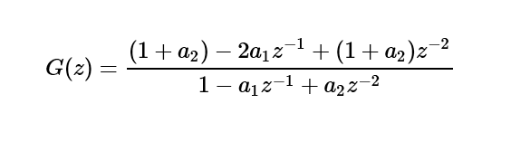
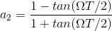
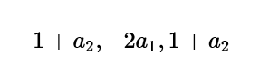
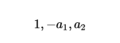
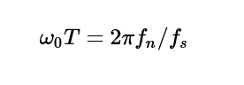
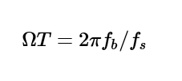

# User-Defined Filter
*Creates a custom finite or infinite impulse response filter*  
  
 Category: [Data Transformation / Filter](data-transformation-filter.md)  

[!INCLUDE [studio-ui-applies-label](../includes/studio-ui-applies-label.md)]
  
## Module overview

This article describes how to use the **User-Defined Filter** module in Machine Learning Studio (classic), to define a custom filter by using a finite impulse response (FIR) filter or an infinite impulse response (IIR) filter with coefficients that you specify.

A filter is a transfer function that takes an input signal and creates an output signal based on the filter characteristics. For more general information about the user of filters in digital signal processing, see [Filter](data-transformation-filter.md). This module is particularly useful for applying a set of previously derived filter coefficients to your data.

After you have defined a filter that meets your needs, you can apply the filter to data by connecting a dataset and the filter to the [Apply Filter](apply-filter.md) module.

> [!TIP]
> Need to filter data from a dataset or remove missing values? Use these modules instead:  
> 
> - [Clean Missing Data](clean-missing-data.md): Use this module to remove missing values or replace missing values with placeholders.  
> - [Partition and Sample](partition-and-sample.md): Use this module to divide or filter your dataset by criteria such as a range of dates, a specific value, or regular expressions.  
> - [Clip Values](clip-values.md): Use this module to set a range and keep only the values within that range.

## How to configure User-Defined Filter

1. Add the **User-Defined Filter** module to your experiment in Studio (classic). You can find this module under **Data Transformation**, in the **Filter** category.

2. In the **Properties** pane, choose a type of filter: FIR filter, or IIR filter.
  
3.  Provide the coefficients to apply in the filter. The requirements for the coefficients differ depending on whether you choose a FIR filter or an IIR filter.

    - For a FIR filter, you specify a vector of feed-forward coefficients. The length of the vector determines the filter's order. A FIR filter is effectively a moving average, so the configuration values apply a moving average to filter a data sequence.

    - For an IIR filter, you apply custom feed-forward and feed-backward coefficients. See the [Examples](#bkmk_Examples) section for some tips.

3.  Connect the filter to [Apply Filter](apply-filter.md), and connect a dataset.

     Use the column selector to specify which columns of the dataset to which the filter should be applied. By default, the [Apply Filter](apply-filter.md) module will use the filter for all selected numeric columns.

4.  Run the experiment.

     The specified transformations are applied to the selected numeric columns only when you run the experiment using [Apply Filter](apply-filter.md).

##  <a name="bkmk_Examples"></a> Examples

For more examples of how filters are used in machine learning, see the [Azure AI Gallery](https://gallery.azure.ai/):

- [Filters](https://go.microsoft.com/fwlink/?LinkId=525732): Demonstrates all filter types. The example uses an engineered waveform dataset to more easily illustrate the effects of the different filters.  

###  FIR filter example: Exponential weighted moving average

For an exponentially weighted moving average, all coefficients are less than one and the sum of all coefficients equals one. Therefore, the variance of the weighted average will always be less than the input values.

For example, for a FIR filter to approximate an exponentially weighted moving average (WMA), you would supply a comma-separated list of coefficients for the value for the feed-forward parameter:

```text
0.01818182, 0.03636364, 0.05454545, 0.07272727, 0.09090909, 0.10909091, 0.12727273, 0.14545455, 0.16363636, 0.18181818
```

###  FIR filter example: Exponential weighted moving average (Deslauriers-Dubuc interpolation)  

This FIR filter approximates a triangularly weighted moving average (WMA). You define the coefficients by supplying a comma-separated series of values for the feed-forward parameters, such as these:  

```text
0.0625, 0.0625, 0.2500, 0.3750, 0.2500, 0.0625
```

The values used in this custom FIR filter represent a vector of feed-forward coefficients obtained by using the Deslauriers-Dubuc method of finite sequencing. For more information, see [Dubuc-Deslauriers Subdivision for Finite Sequences and Interpolation Wavelets on an Interval](https://pdfs.semanticscholar.org/3fb4/90ff424cb919fa18e6aa7d1c8ed7ab106da7.pdf).

###  IIR filter example: Notch filter

A good example of an application for a user-defined IIR filter is to define a *notch filter*, also called a *bandstop filter*. The desired notch filter attenuates a -3dB rejection band, *fb*, centered at a notch frequency, `fn`, with a sampling frequency, `fs`. 

In this case, the digital notch filter can be represented by the following formula:

   
  
 This formula assumes:  
  
   
  
From this formula, we can get the feed-forward coefficient:  
  
   
  
 The feed-backward coefficients would be as follows:  
  
   
  
### Example of IIR Filter: Notch filter 2

The following example shows a notch filter with a notch frequency of `fn =1250 Hz` and a `-3 dB` rejection band of `fb =100 Hz`, with sampling frequency of `fs=10 kHz`.  
  
   
  
 Using the following formula, you get `a2 = 0.93906244` and `a1 = 1.3711242`:  
  
   

From this, you can get the following feed-forward (b) and feed-backward (a) coefficients:  
  
 b= `1.9390624, -2.7422484, 1.9390624`  
  
 a= `1, -1.3711242, 0.9390624`  

##  Module parameters

|Name|Range|Type|Default|Description|  
|----------|-----------|----------|-------------|-----------------|  
|Type of filter|any|ImpulseResponse||Specify the type of filter to customize|  
|Forward|any|String|"1.0"|Type a series of feed-forward coefficients|  
|Backward|any|String|"1.0"|Type a series of feed-backward filter coefficients|  
  
##  Output

|Name|Type|Description|  
|----------|----------|-----------------|  
|Filter|[IFilter interface](ifilter-interface.md)|Filter implementation|  

##  Exceptions

|Exception|Description|  
|---------------|-----------------|  
|ParameterParsing|An exception occurs if one or more parameters could not be parsed or converted from the specified type into the type that is required by the target method.|  

For a list of errors specific to Studio (classic) modules, see [Machine Learning Error codes](errors/machine-learning-module-error-codes.md).

For a list of API exceptions, see [Machine Learning REST API Error Codes](/azure/machine-learning/studio/web-service-error-codes).  

## See also  
 [Apply Filter](apply-filter.md)   
 [A-Z Module List](a-z-module-list.md)
