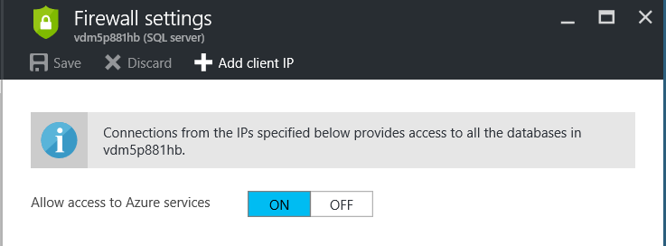
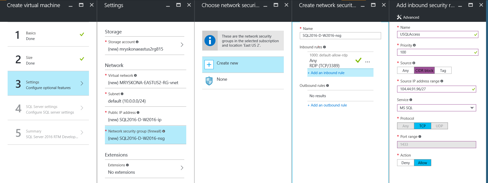

# CREATE DATA SOURCE (U-SQL)
U-SQL provides the `CREATE DATA SOURCE` statement to create a data source.  Data Sources give U-SQL the ability to query data from other data sources such as other databases. It contains the connection information as well as information about its capabilities to execute query expressions passed and translated from U-SQL to the its local query engine. For example, U-SQL allows to create a data source on an Azure SQL Database which then allows U-SQL queries to select from tables in that database. 

> [!NOTE]
> In order for the data source to be accessible in [federated queries](u-sql-select-selecting-from-an-external-rowset.md), the firewall rules of the external data source has to provide access to Azure Data Lake Analytics. See the descriptions under [External_Source](#ex_src) for more details. 
  
<table><th align="left">Syntax</th><tr><td><pre>
Create_Datasource_Statement :=                                                                           
    'CREATE' 'DATA' 'SOURCE' [<a href="#INE">'IF' 'NOT' 'EXISTS'</a>] <a href="#dsrc_name">Datasource_Name</a>  
    'FROM' <a href="#ex_src">External_Source</a>   
    'WITH' '(' <a href="#dsrc_opt">Datasource_Options</a> ')'.<br />
<a href="#dsrc_name">Datasource_Name</a> := 
    <a href="u-sql-identifiers.md">Quoted_or_Unquoted_Identifier</a>.</pre></td></tr></table>
  
### Semantics of Syntax Elements    
- <a name="dsrc_name"></a>**`Datasource_Name`**  
  Specifies the name of the data source to be created in the current static database context. If an object of the given name already exists in the database context or the user has no permissions to create a data source, an error is raised.  
  
- <a name="INE"></a>**`IF NOT EXISTS`**  
  If the optional `IF NOT EXISTS` is specified, then the statement creates the data source if it does not already exist, or succeeds without changes if the data source already exists and the user has permission to at least enumerate all existing data sources.  
  
- <a name="ex_src"></a>**`External_Source`**   
  Specifies the type of data source that gets created. This keyword indicates what type of remote capabilities are available for executing federated queries and implies the options that can be specified in the data source options.

  Currently supported are:  
  <table><th>Syntax</th><tr><td><pre>
  External_Source :=                                                                                  
      'AZURESQLDB' | 'AZURESQLDW' | 'SQLSERVER'.</pre></td></tr></table>

  |External_Source|Description|
  |---|---|   
  | AZURESQLDB | Specifies that the external source is a Microsoft Azure SQL Database instance. |  
  | AZURESQLDW | Specifies that the external source is a Microsoft Azure SQL Datawarehouse instance. |  
  | SQLSERVER  | Specifies that the external source is a Microsoft SQL Server instance running in an accessible Microsoft Azure VM. Currently SQL Server 2012 and newer are supported.|
    
  In order to provide U-SQL access to query the SQL Server instance, the Azure Datalake Analytics service needs to be whitelisted as follows:  

  - **AZURESQLDB and AZURESQLDW**  
    Configure the SQL Server (not the database) firewall to allow access to Azure Services. The following screenshot shows the option:  

    

  - **SQLSERVER**  
    Configure the Azure VM firewall to open the SQL Server endpoint to the IP range specific to your data region where you are running your U-SQL scripts for SQL Server traffic.   To identify your region, see the [Review Region](#region) example further below.

    The current IP ranges are:   
    
    |Region|IP Ranges|
    |--|--|
    |Europe North|104.44.91.64/27|
    |Europe West|104.44.93.192/27|
    |US Central|104.44.91.160/27, 40.90.144.0/27|
    |US East 2|104.44.91.96/27, 40.90.144.64/26|
  
    For example, the following screenshot show an example configuration when configuring an Azure VM with SQL Server for the US East 2 region:

     

    If, after this configuration, the following error is raised when querying a SQLSERVER data source:
  
    ```  
    Error number: 10060, message: A network-related or instance-specific error occurred while establishing a connection to SQL Server. The server was not found or was not accessible. Verify that the instance name is correct and that SQL Server is configured to allow remote connections. (provider: TCP Provider, error: 0 - A connection attempt failed because the connected party did not properly respond after a period of time, or established connection failed because connected host has failed to respond.)
    ```    
    
    check the following possible causes:
    1.  Make sure that the credential information for the data source object is correct provides access to the SQL Server instance.
    2.  Make sure that the data source is correctly configured and that the provided provider string information is correct.
    3.  If both a and b are correct, the U-SQL job may be running from a machine that has not been whitelisted. If the whitelisting step above was followed and the error still occurs, please contact your Microsoft Support contact to get the new IP ranges.<p></p>  

- <a name="dsrc_opt"></a>**`Datasource_Options`**    
  Specifies the options that are being used to connect and interact with the external data source. These options are source specific (although at the moment they all apply to the three supported sources).

  <table><th>Syntax</th><tr><td><pre>
  Datasource_Options :=                                                                               
      Datasource_Option {',' Datasource_Option}.<br />
  Datasource_Option :=
      '<a href="#cred">CREDENTIAL</a>' '=' Credential_Identifier
      '<a href="#p_strng">PROVIDER_STRING</a>' '=' lexical_provider_string.
      '<a href="#rmv_typ">REMOTABLE_TYPES</a>' '=' '(' [Remotable_Types] ')'.<br />
  Remotable_Types :=
      <a href="simple-built-in-u-sql-types.md">Simple_Type</a> {',' <a href="simple-built-in-u-sql-types.md">Simple_Type</a> }.</pre></td></tr></table>

  - <a name="cred"></a>**`CREDENTIAL`** (mandatory)  
    The `CREDENTIAL` option has to be specified exactly once and refers to the credential of the given name in the current static database context. If the credential is not specified, or specified more than once, does not exist, or the user has no permissions to use it, an error is raised.  
    
    The credential object contains the information about the data source, the port, the external data source’s user id and password that will be used to populate the ADO.Net Provider String’s `Server`, `UserID` and `Password` options.  
      
    See [New-AzureRmDataLakeAnalyticsCatalogCredential](https://docs.microsoft.com/powershell/resourcemanager/azurerm.datalakeanalytics/v2.3.0/new-azurermdatalakeanalyticscatalogcredential) for information on how to create a new Azure Data Lake Analytics catalog credential.
  
  - <a name="p_strng"></a>**`PROVIDER_STRING`**   
    The `PROVIDER_STRING` data source option allows the user to specify additional ADO.Net connection string options besides the ones that are being provided through the CREDENTIAL option. If the `Data Source` (and its aliases, including `Server`), `UserID/UID` or `Password/PWD` options are specified in the PROVIDER_STRING, an error is raised.  
    
    The `PROVIDER_STRING` data source option can be specified at most once. If it is left away, the defaults listed below are set. If it has been specified more than once, an error is raised.  
    
    The following table provides the connection string options that can be provided in the connection string and their defaults (see [SqlConnection.ConnectionString Property](https://msdn.microsoft.com/library/system.data.sqlclient.sqlconnection.connectionstring%28v=vs.110%29.aspx) for their meaning):  
  
    | **Option** | **Default** |  
    |---|---|  
    | App/Application Name | Azure Data Lake Analytics |  
    | Current Language/Language | N/A |  
    | Initial Catalog/Database | N/A |  
    | Type System Version | N/A  |  
  
    In addition, U-SQL sets some of the connection string options for its own processing that cannot be overwritten. If they appear in the PROVIDER_STRING they are overwritten with the default or an error is raised (see table below). These reserved options are:  
 
    | **Option** | **Enforced Default** | **Error raised?** |  
    |---|---|---|  
    | ApplicationIntent | ReadOnly | No |  
    | Connect Timeout/Connection Timeout/Timeout | 30 seconds | No |  
    | ConnectRetryCount | 3 during Compilation; 6 during Execution | No |  
    | ConnectRetryInterval | 3 to 7 seconds | No |  
    | Encrypt | True | Yes |  
    | Enlist | False | No |  
    | Integrated Security/Trusted_Connection | False | Yes |  
    | Persist Security Info/PersistSecurityInfo | False | No |  
    | TrustServerCertificate | False | Yes |  

    > [!IMPORTANT]
    > The external source SQLSERVER allows overwriting Encrypt and TrustServerCertificate, but a severe warning is raised and it is strongly advised against overwriting these options.
  
    Any option that is not listed in the tables above or provided by means of the CREDENTIAL object will be set to its default value according to the [SqlConnection.ConnectionString Property](https://msdn.microsoft.com/library/system.data.sqlclient.sqlconnection.connectionstring%28v=vs.110%29.aspx) documentation.  
  
  - <a name="rmv_typ"></a>**`REMOTABLE_TYPES`**   
    The `REMOTABLE_TYPES` option specifies the list of [simple built-in U-SQL types](simple-built-in-u-sql-types.md)  for which the U-SQL query evaluation will push supported expressions to the external data source. For example, if the option specifies `int` and `string` as a remotable type but not `double` then comparisons, some known string expressions and other supported expressions on columns mapped to `int` and `string` will be executed remotely, preserving the C# semantics as closely as possible, while the expressions on columns mapped to double will be executed in U-SQL. It can be specified at most once. If it is not specified, then no expressions will be sent to the external data source for remote execution. If it is specified more than once, an error is raised.  
   
> [!IMPORTANT]
> `CREATE DATA SOURCE` itself does not check if the remote source is accessible with the provided credentials and provider settings. Currently the connection is checked with [CREATE EXTERNAL TABLE](create-external-table-u-sql.md) and when [selecting from an external data source](u-sql-select-selecting-from-an-external-rowset.md).

### Examples 
- The examples can be executed in Visual Studio with the [Azure Data Lake Tools plug-in](https://www.microsoft.com/download/details.aspx?id=49504).  

**Review Region**<a name="region"></a>  
Use the following PowerShell command to confirm the Region associated with your Azure Data Lake Analytics account.
```powershell
Login-AzureRmAccount;

$DataLakeAnalyticsAccount = "<adla_account>";
(Get-AzureRmDataLakeAnalyticsAccount -Name $DataLakeAnalyticsAccount).Location;
```

**Create Credential**   
The [New-AzureRmDataLakeAnalyticsCatalogCredential](https://docs.microsoft.com/powershell/resourcemanager/azurerm.datalakeanalytics/v2.3.0/new-azurermdatalakeanalyticscatalogcredential) cmdlet creates a new credential to use in an Azure Data Lake Analytics catalog for connecting to external data sources.
The syntax is illustrated below:
```powershell
Login-AzureRmAccount;
Set-AzureRMContext -SubscriptionId <SubscriptionId>;

# AZURESQLDB
New-AzureRmDataLakeAnalyticsCatalogCredential -AccountName "<adla_account>" -DatabaseName "TestReferenceDB" -CredentialName "MyAzureSQLDBCredential" -Credential (Get-Credential) -DatabaseHost "<AZURESQLDB>.database.windows.net" -Port 1433;

# AZURESQLDW
New-AzureRmDataLakeAnalyticsCatalogCredential -AccountName "<adla_account>" -DatabaseName "TestReferenceDB" -CredentialName "MyAzureSQLDWCredential" -Credential (Get-Credential) -DatabaseHost "<AZURESQLDW>.database.windows.net" -Port 1433;

# SQLSERVER
New-AzureRmDataLakeAnalyticsCatalogCredential -AccountName "<adla_account>" -DatabaseName "TestReferenceDB" -CredentialName "MySQLServerCredential" -Credential (Get-Credential) -DatabaseHost "<IP>" -Port 1433;
```

**Create Data Source - AZURESQLDB**   
```sql
USE DATABASE TestReferenceDB;

CREATE DATA SOURCE MyAzureSQLDBDataSource
FROM AZURESQLDB
WITH
(
    PROVIDER_STRING = "Database=AdventureWorksLT;Trusted_Connection=False;Encrypt=True",
    CREDENTIAL = MyAzureSQLDBCredential,
    REMOTABLE_TYPES = (bool, byte, sbyte, short, ushort, int, uint, long, ulong, decimal, float, double, string, DateTime)
);
``` 

**Create Data Source - AZURESQLDW**   
```sql
USE DATABASE TestReferenceDB;

CREATE DATA SOURCE IF NOT EXISTS MyAzureSQLDWDataSource
FROM AZURESQLDW
WITH
(
    PROVIDER_STRING = "Database=AdventureWorksDW;Trusted_Connection=False;Encrypt=True",
    CREDENTIAL = MyAzureSQLDWCredential,
    REMOTABLE_TYPES = (bool, byte, sbyte, short, ushort, int, uint, long, ulong, decimal, float, double, string, DateTime)
);
```

**Create Data Source - SQLSERVER**   
```sql
USE DATABASE TestReferenceDB;
DROP DATA SOURCE IF EXISTS MySQLServerDataSource;

CREATE DATA SOURCE MySQLServerDataSource
FROM SQLSERVER
WITH
(
    PROVIDER_STRING = "Database=AdventureWorks2016;Trusted_Connection=False;Encrypt=True;TrustServerCertificate=True",
    CREDENTIAL = MySQLServerCredential,
    REMOTABLE_TYPES = (bool, byte, sbyte, short, ushort, int, uint, long, ulong, decimal, float, double, string, DateTime)
);
```

**Query Data Source - Method 1**   
```sql
USE DATABASE TestReferenceDB;

@results =
    SELECT *
    FROM EXTERNAL MyAzureSQLDBDataSource EXECUTE 
        @"SELECT @@SERVERNAME AS serverName, GETDATE() AS dayTime, DB_NAME() AS databaseName, * FROM dbo.BuildVersion WITH (NOLOCK)";

OUTPUT @results
TO "/Output/ReferenceGuide/DDL/DataSources/Query1A.csv"
USING Outputters.Csv(outputHeader: true);


@results =
    SELECT *
    FROM EXTERNAL MyAzureSQLDWDataSource EXECUTE 
        @"SELECT GETDATE() AS dayTime, DB_NAME() AS databaseName, * FROM dbo.AdventureWorksDWBuildVersion WITH (NOLOCK)";

OUTPUT @results
TO "/Output/ReferenceGuide/DDL/DataSources/Query1B.csv"
USING Outputters.Csv(outputHeader: true);


@results =
    SELECT *
    FROM EXTERNAL MySQLServerDataSource EXECUTE 
        @"SELECT @@SERVERNAME AS serverName, GETDATE() AS dayTime, DB_NAME() AS databaseName, * FROM dbo.AWBuildVersion WITH (NOLOCK)";

OUTPUT @results
TO "/Output/ReferenceGuide/DDL/DataSources/Query1C.csv"
USING Outputters.Csv(outputHeader: true);
```

**Query Data Source - Method 2**   
```sql
USE DATABASE TestReferenceDB;

@results =
    SELECT DateTime.Now AS dayTime, *
    FROM EXTERNAL MyAzureSQLDBDataSource LOCATION "dbo.BuildVersion";

OUTPUT @results
TO "/Output/ReferenceGuide/DDL/DataSources/Query2A.csv"
USING Outputters.Csv(outputHeader: true);


@results =
    SELECT DateTime.Now AS dayTime, * 
    FROM EXTERNAL MyAzureSQLDWDataSource LOCATION "dbo.AdventureWorksDWBuildVersion";

OUTPUT @results
TO "/Output/ReferenceGuide/DDL/DataSources/Query2B.csv"
USING Outputters.Csv(outputHeader: true);


@results =
    SELECT *
    FROM EXTERNAL MySQLServerDataSource LOCATION "dbo.AWBuildVersion";

OUTPUT @results
TO "/Output/ReferenceGuide/DDL/DataSources/Query2C.csv"
USING Outputters.Csv(outputHeader: true);
```
  
### See Also
* [U-SQL Data Sources](u-sql-data-sources.md)  
* [ALTER DATA SOURCE (U-SQL)](alter-data-source-u-sql.md)  
* [DROP DATA SOURCE (U-SQL)](drop-data-source-u-sql.md)  
* [CREATE EXTERNAL TABLE (U-SQL)](create-external-table-u-sql.md)  
* [U-SQL SELECT Selecting from an External Rowset](u-sql-select-selecting-from-an-external-rowset.md)  
* [SqlConnection.ConnectionString Property](https://msdn.microsoft.com/library/system.data.sqlclient.sqlconnection.connectionstring%28v=vs.110%29.aspx)  
* [Data Definition Language (DDL) Statements (U-SQL)](data-definition-language-ddl-statements-u-sql.md)  
* [New-AzureRmDataLakeAnalyticsCatalogCredential](https://docs.microsoft.com/powershell/resourcemanager/azurerm.datalakeanalytics/v2.3.0/new-azurermdatalakeanalyticscatalogcredential)

  
