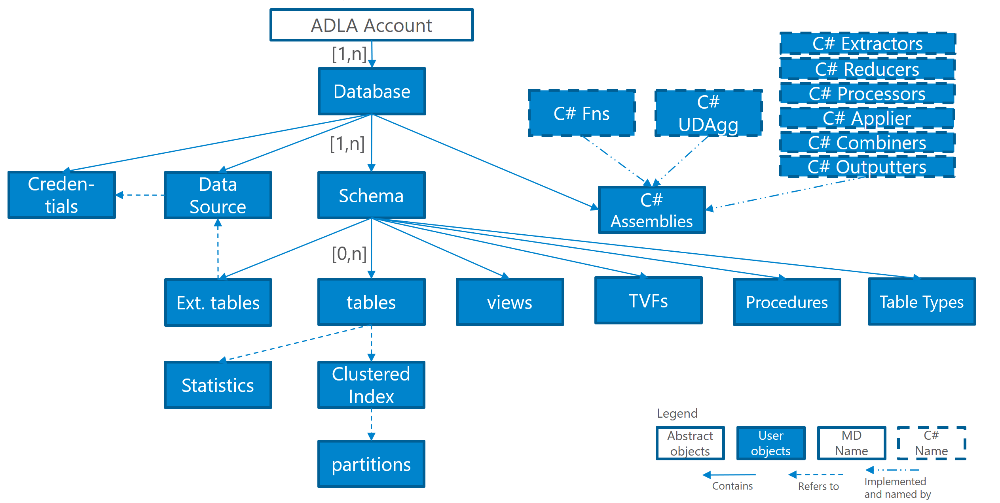

# Data Definition Language (DDL) Statements (U-SQL)
While one of U-SQL’s strength is to operate on unstructured data stored in files, it can also provide structured views over the unstructured data, manage structured data in tables and provides a general metadata catalog system to organize your structured data and custom code, secure it and make it discoverable.  
  
Each meta data object is given a name and the objects are arranged in the following object hierarchy:  
  
  
  
U-SQL metadata objects are name-scoped to their containers (e.g., views and tables are scoped to database schemas) which provide a single namespace for all object types within a container. Thus names cannot be shared across different object types in the same container (e.g., a view and table in the same schema cannot have the same name). The metadata objects are addressed with their [U-SQL object identifier](../u-sql/identifiers-u-sql.md) (follow the link for more information on the form of [U-SQL object identifiers](../u-sql/identifiers-u-sql.md) and how they are being resolved).  
 
Objects that are included from the C# context, such as the names of functions, classes, methods provided by the assemblies, do not require metadata object names but instead are being references using their C# names after the assemblies are being referenced by their metadata object names in the scripts.  
  
In the following, we use the concepts of a *static database context* and *static schema context* which designate the default database and schema names that are used to resolve names that are not fully qualified during both compilation and execution:  
  
All unqualified schema bound object names (such as functions and table names) will be resolved against the current static schema context within the current static database context. Individual names can overwrite the resolution by using multi-part names (so called qualified names). E.g., T will be resolved against the current context, S.T will resolve the object name T in the schema S in the current static database context, and D.S.T will resolve the object name T in the schema S in the database D.  
  
Note that names inside U-SQL functions are resolved based on the context during compilation of the function, and not the dynamic context during use.  
  
All metadata objects except credentials are being created and managed with the following Data Definition Language (DDL) statements. 
  
### DDL Statements (U-SQL)  
  
<table><th align="left">Syntax</th><tr><td><pre>
DDL_Statement :=                                                                                         
    <a href="u-sql-databases.md">DB_DDL_Statement</a>  
|   <a href="u-sql-database-schemas.md">Schema_DDL_Statement</a>  
|   <a href="u-sql-tables.md">Table_DDL_Statement</a>  
|   <a href="u-sql-indexes.md">Index_DDL_Statement</a>  
|   <a href="u-sql-statistics.md">Statistics_DDL_Statement</a>  
|   <a href="u-sql-views.md">View_DDL_Statement</a>  
|   <a href="u-sql-functions.md">Function_DDL_Statement</a> 
|   <a href="u-sql-packages.md">Package_DDL_Statement</a>   
|   <a href="u-sql-procedures.md">Procedure_DDL_Statement</a>  
|   <a href="u-sql-assemblies.md">Assembly_DDL_Statement</a>  
|   <a href="u-sql-data-sources.md">Datasource_DDL_Statement</a>  
|   <a href="user-defined-u-sql-types.md">Type_DDL_Statement</a>.
</pre></td></tr></table>
 
 Credentials have to be created and managed with the credential management commandlets in the latest Azure Powershell.
See [Set-AzureRmDataLakeAnalyticsCatalogCredential](https://docs.microsoft.com/powershell/module/azurerm.datalakeanalytics/set-azurermdatalakeanalyticscatalogcredential?view=azurermps-4.3.1) for information on creating and managing an Azure Data Lake Analytics catalog credential.

 
### See also  
* [Get-AzureRmDataLakeAnalyticsCatalogItem](https://docs.microsoft.com/powershell/resourcemanager/azurerm.datalakeanalytics/v2.7.0/get-azurermdatalakeanalyticscatalogitem) 
