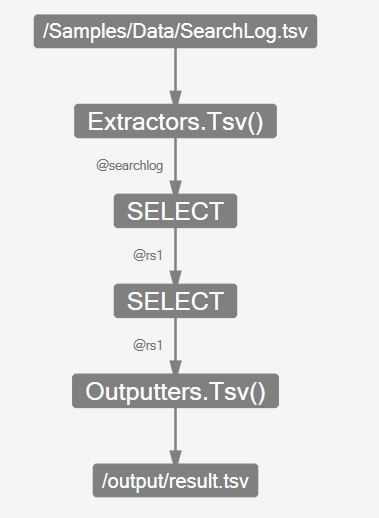
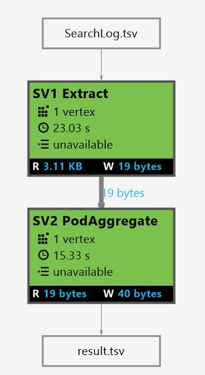

# U-SQL Scripts
The main unit of a U-SQL “program” is a U-SQL script. A script consists of a sequence of U-SQL statements.  
  
<table><th align="left">Syntax</th><tr><td><pre>
Script :=                                                                                                
     <a href="#stmt">Statement_List</a>.
</pre></td></tr></table>
 
### Semantics of Syntax Elements    
- <a name="stmt"></a>**`Statement_List`**  
  The main body of a script is a sequence of statements:  
  
  <table><th>Syntax</th><tr><td><pre>
  Statement_List :=                                                                                   
       { [Statement] ';' }.
  </pre></td></table>
  
  Each statement is terminated by a semi-colon (;). Statements can be empty or one of  

  <table><th>Syntax</th><tr><td><pre>
  Statement :=                                                                                        
       <a href="u-sql-metadata-object-naming-and-name-contexts.md">Use_Statement</a>  
  |    <a href="if-else-u-sql.md">If_Else_Statement</a> 
  |    <a href="variables-u-sql.md">Declare_Variable_Statement</a>  
  |    <a href="reference-assembly-u-sql.md">Reference_Assembly_Statement</a>  
  |    Deploy_Resource_Statement 
  |    <a href="data-definition-language-ddl-statements-u-sql.md">DDL_Statement</a>  
  |    <a href="query-statements-and-expressions-u-sql.md">Query_Statement</a>  
  |    <a href="u-sql-procedures.md">Procedure_Call</a>  
  |    <a href="import-package-u-sql.md">Import_Package_Statement</a>  
  |    <a href="data-modification-language-dml-statements-u-sql.md">DML_Statement</a>  
  |    <a href="output-statement-u-sql.md">Output_Statement</a>.
  </pre></td></table>
  
  For more details on the individual statements follow the links to their definitions.  
  
  Note that some statements have restrictions on how they can be combined inside a script. For example, you cannot create a table and read from the same table in the same script, since the compiler requires that any input already physically exists at compile time of the query.  
  
### Examples    
- The examples can be executed in Visual Studio with the [Azure Data Lake Tools plug-in](https://www.microsoft.com/download/details.aspx?id=49504).  
- The examples below use the sample data provided with your Data Lake Analytics account. See [Prepare source data](https://docs.microsoft.com/azure/data-lake-analytics/data-lake-analytics-get-started-portal#prepare-source-data) for additional information.

The following shows an extended sample script that operates on one of the U-SQL sample data sets:  
```  
DECLARE @in  string = "/Samples/Data/SearchLog.tsv";  
DECLARE @out string = "/output/result.tsv";  
  
@searchlog =  
    EXTRACT UserId          int,  
            Start           DateTime,  
            Region          string,  
            Query           string,  
            Duration        int?,  
            Urls            string,  
            ClickedUrls     string  
    FROM @in  
    USING Extractors.Tsv();  
  
@rs1 =  
    SELECT Start, Region, Duration  
    FROM @searchlog  
    WHERE Region == "en-gb";  
  
@rs1 =  
    SELECT Start, Region, Duration  
    FROM @rs1  
    WHERE Start >= DateTime.Parse("2012/02/16") AND Start <= DateTime.Parse("2012/02/17");  
  
OUTPUT @rs1     
TO @out  
USING Outputters.Tsv();
```
The script starts with two DECLARE variable statements that declare the variables @in and @out that contain the input and output path names respectively. Then it assigns the variable @searchlog to the [EXTRACT](../u-sql/extract-expression-u-sql.md) expression which then will be used in the next [SELECT](../u-sql/select-expression-u-sql.md) expression, which does a filter on the Region column. This [SELECT](../u-sql/select-expression-u-sql.md)  expression will be assigned to the variable @rs1. The @rs1 variable will be further refined with the next [SELECT](../u-sql/select-expression-u-sql.md)  expression that adds a range filter on the Start property before it is written to the output file using an [OUTPUT](../u-sql/output-statement-u-sql.md) statement.  
 
Hopefully, you have stumbled over the wording “assigned the variable to the statement” in the paragraph above. This wording is calling out an important aspect of U-SQL scripts and the processing of a U-SQL script. While it seems that we assign the resulting rowset of each expression to a variable that we then process in the next step, in fact U-SQL is NOT calculating the result at this point in the script.  
  
Instead each variable you see is actually a name for the expression that it is being assigned to. What this means is that U-SQL is not executing each statement sequentially, but composes bigger and bigger statements until there is a big expression tree that then gets optimized and executed as a whole. In language theory this is also known as lambda expression composition.  
  
As a consequence, a single U-SQL script can contain several such expression trees that will be all executed in parallel without producing intermediate state. This gives the U-SQL execution the ability to optimize expressions across the whole script. For example, if none of the later expressions refer to a column that gets extracted in the beginning, the optimizer may decide to not actually extract the column, or a predicate that gets applied to a later rowset is being pushed to be executed much earlier to reduce the amount of data that gets processed in the intermediate steps.  
  
However, it also means that one cannot perform intermediate investigations of state to determine different workflows inside the script. Such investigations either have to be written within the declarative framework or be delegated to an external workflow that will orchestrate individual scripts that produce intermediate snapshot results in files to help with the workflow orchestration.  
  
The following images show the logical expression tree and the physical job graph of the above script as shown in the [Azure DataLake Tool for VisualStudio](https://www.microsoft.com/download/details.aspx?id=49504).  
  
### Logical Expression Tree  
  
  
  
### Physical Job Graph  
  
  
  
### See Also
* [U-SQL Language Reference](../u-sql/u-sql-language-reference.md)

